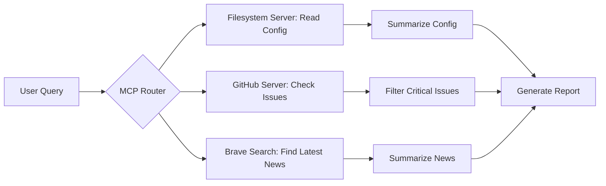

# MCP 配置與整合

## 什麼是 MCP？

MCP（Model Context Protocol）是一種標準化的協議，用於將大型語言模型（LLM）與外部資料源、工具和運行環境連接起來。透過 MCP，開發者可以：
- 將自定義的資料源（如檔案系統、資料庫、API）註冊為模型可訪問的上下文
- 標準化工具的描述和調用方式
- 在不同的 LLM 提供者和平台之間實現工具的互通性

MCP 讓語言模型不僅限於其訓練時的知識，能夠即時存取和操作外部資訊，從而執行更複雜、更實用的任務。

## OpenClaw 中的 MCP 支援

OpenClaw 內建支援透過 `mcporter` CLI 來管理和使用 MCP 伺服器。`mcporter` 是一個多功能工具，允許您：
- 列出、配置和認證 MCP 伺服器
- 直接呼叫 MCP 伺服器提供的工具（不管是 HTTP 還是 stdio 型別）
- 生成工具的類型定義和客戶端程式碼
- 建立臨時的 ad-hoc MCP 伺服器進行測試

## 安裝與設定

### 1. 安裝 mcporter
mcporter 通常隨 OpenClaw 一起安裝。若需要單獨安裝：
```bash
npm install -g @openclaw/mcporter
# 或透過 clawhub
openclaw clawhub install mcporter
```

### 2. 基本指令
```bash
# 列出已配置的 MCP 伺服器
openclaw mcporter list

# 添加新的 MCP 伺服器（範例：本地檔案系統伺服器）
openclaw mcporter add filesystem --command "npx @modelcontextprotocol/server-filesystem" --args "/path/to/allowed/directory"

# 認證伺服器（如果需要）
openclaw mcporter auth <serverName>

# 測試連線
openclaw mcporter ping <serverName>

# 列出伺服器提供的工具
openclaw mcporter tools <serverName>

# 呼叫伺服器的工具
openclaw mcporter call <serverName> <toolName> --arguments '{"path": "./README.md"}'
```

### 3. 常見 MCP 伺服器類型

| 伺服器名稱 | 用途 | 安裝方式 |
|------------|------|----------|
| `filesystem` | 訪問本地檔案系統 | `npx @modelcontextprotocol/server-filesystem` |
| `github` | 整合 GitHub API | 需要額外設置和認證 |
| `postgres` | 連接 PostgreSQL 資料庫 | `npx @modelcontextprotocol/server-postgres` |
| `sqlite` | 訪問 SQLite 資料庫 | `npx @modelcontextprotocol/server-sqlite` |
| `brave-search` | 整合 Brave 搜尋引擎 | 需要 API 金鑰 |
| `docker` | 控制 Docker 容器 | `npx @modelcontextprotocol/server-docker` |
| `memory` | 內建記憶體存儲（適合測試） | `npx @modelcontextprotocol/server-memory` |

## 在 OpenClaw 工作流中使用 MCP

### 透過 mcporter 指令
在 Agent 的規劃步驟中，可以使用 `mcporter call` 來讀寫資料或執行操作。

**範例**：讀取設定檔然後總結其內容
```bash
# 假設已配置名為 "local-files" 的 filesystem MCP 伺服器
openclaw mcporter call local-files read --arguments '{"path": "./config/settings.json"}' > /tmp/settings.json
openclaw summarize /tmp/settings.json
```

### 透過腳本整合
在自建的 Skill 或腳本中，可以直接呼叫 `mcporter` CLI。

範例 Python 腳本：
```python
import subprocess
import json

def call_mcp_tool(server, tool, arguments):
    cmd = [
        "openclaw", "mcporter", "call", server, tool,
        "--arguments", json.dumps(arguments)
    ]
    result = subprocess.run(cmd, capture_output=True, text=True)
    if result.returncode != 0:
        raise Exception(f"MCP call failed: {result.stderr}")
    return json.loads(result.stdout)

# 使用範例
try:
    content = call_mcp_tool("local-files", "read", {"path": "./notes/today.md"})
    print("File content:", content.get("text", ""))
except Exception as e:
    print(f"Error: {e}")
```

## 安全考量

### 1. 權限最小化
- 為 MCP 伺服器授予最小必要的權限（例如：僅允許讀取特定目錄，而非整個磁碟）
- 檔案系統伺服器應該使用 `--args` 參數限制可訪問的目錄範圍

### 2. 資料清理
- 從 MCP 伺服器讀取的資料可能包含敏感資訊，使用後應該適當清理
- 若工具回傳大量資料，考慮僅提取所需部分

### 3. 網路安全
- 對於 HTTP 型別的 MCP 伺服器，確保使用可信任的端點
- 注意 API 金鑰和認證資訊的儲存方式

## 進階用法

### 建立臨時 ad-hoc 伺服器
適合測試或一次性任務：
```bash
openclaw mcporter serve npx @modelcontextprotocol/server-memory --port 3000
```

### 生成客戶端程式碼
為了在特定語言中更方便地使用 MCP 伺服器：
```bash
openclaw mcporter generate typescript <serverName> ./generated/<serverName>
```

### 多伺服器編排
複雜工作流可能需要同時使用多個 MCP 伺服器：


## 常見問題

**Q: 如何查看已安裝的 MCP 伺服器？**
A: 執行 `openclaw mcporter list`

**Q: 遇到「伺服器未認證」錯誤該怎麼辦？**
A: 使用 `openclaw mcporter auth <serverName>` 進行認證，或檢查伺服器是否需要額外的環境變數。

**Q: 如何更新 MCP 伺服器？**
A: 重新執行安裝命令（通常是更新對應的 npm 包），或透過 `mcporter remove` 再 `mcporter add`。

**Q: MCP 與內建工具（如 web_search、exec）有什麼區別？**
A: 內建工具是 OpenClaw 特有的，而 MCP 提供了一種標準方式來整合任意第三方服務。MCP 更靈活，但可能需要額外的安裝和配置。

## 參考資料
- MCP 官方規格：https://modelcontextprotocol.io
- `@modelcontextprotocol` npm 組織：https://www.npmjs.com/org/modelcontextprotocol
- OpenClaw mcporter 技能文件：執行 `openclaw mcporter --help`
- 範例伺服器：https://github.com/modelcontextprotocol/servers