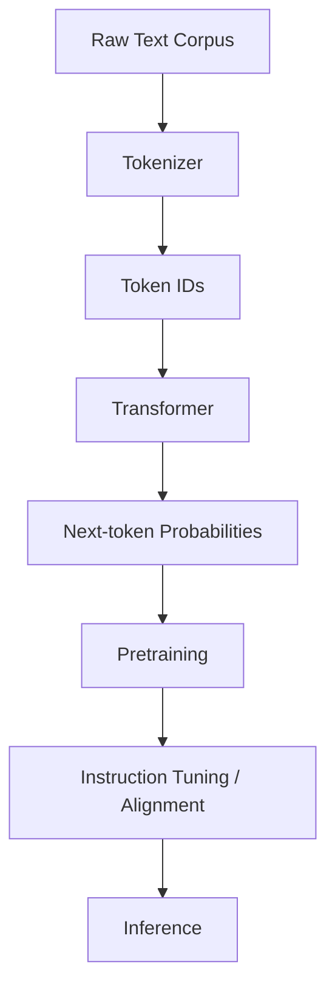

# Level 1：AI 入門基礎

> 最後更新：2026-04-26
> 相關論文：[Attention Is All You Need](https://arxiv.org/abs/1706.03762)、[Training Compute-Optimal Large Language Models](https://arxiv.org/abs/2203.15556)

## 概覽與設計動機
這份 Level 1 文件不是要用大眾科普方式重講「AI 是什麼」，而是要幫一位已有工程背景的讀者建立後續學習 AI 系統所需的最小正確心智模型。AI 是總稱，Machine Learning 是其中讓系統從資料而不是手寫規則中學習行為的方法，Deep Learning 則是用深層神經網路學習高維表示的主流路線。當今 LLM 的爆發，並不是因為語言突然變簡單，而是因為 Transformer 讓大規模並行訓練、長距離依賴建模與表示學習取得了新的平衡點。

如果沒有這個層次的理解，後續學習 RAG、Agent、Prompt Engineering 時很容易把所有技術都誤看成「套件組合」。實際上，很多工程 trade-off 都能回推到這一層：為什麼 token 成本重要、為什麼 context window 不是越大越好、為什麼 inference latency 會限制產品形態、為什麼模型大小不是唯一優化方向。從 Chinchilla 的 compute-optimal scaling 結論也能看出，產業已不再只是追求更大參數，而是追求訓練資料量、推理成本與下游效能之間更可持續的平衡。

## 核心機制深度解析

### 關鍵名詞與專案拆解

| 名詞 / 專案 | 它解決什麼問題 | 核心機制 | 與相鄰技術差異 | 何時適合 / 不適合 |
|-------------|----------------|----------|----------------|-------------------|
| AI | 讓系統展現智慧行為 | 搜尋、規則、學習等方法總稱 | 範圍最大，不代表特定演算法 | 適合描述領域；不適合當成實作細節 |
| Machine Learning | 規則難以手寫時，從資料學習 | 最小化損失函數，從資料擬合參數 | 比傳統規則系統能泛化；但需要資料 | 適合模式辨識；不適合完全無資料場景 |
| Deep Learning | 特徵工程太昂貴 | 多層神經網路自動學表示 | 比傳統 ML 更依賴算力與資料 | 適合高維資料；不適合極小資料集 |
| Transformer | RNN/CNN 難以平行處理長序列 | Self-Attention + MLP + positional encoding | 比 RNN 更平行；但 attention 成本較高 | 適合文字、長序列；不適合極低資源裝置 |
| LLM | 通用語言理解與生成 | 大規模 next-token pretraining | 比任務專用模型泛化更強；成本也更高 | 適合多任務；不適合超嚴格 deterministic 任務 |
| Embedding | 需要把語意映成可計算空間 | 將文字投射到向量空間 | 比 one-hot 更能表示語意相近性 | 適合搜尋與聚類；不適合直接當最終答案 |

### 從資料到推理的流程
一個現代 LLM 系統至少會經過以下幾層：

1. 收集與清理語料，去重、過濾低品質內容。
2. 將文字 tokenization，轉成模型可處理的離散符號序列。
3. 以 next-token prediction 做預訓練，學會語言統計規律與表徵。
4. 視需求再做 instruction tuning、preference optimization 或 domain adaptation。
5. 在 inference 階段根據 prompt、解碼策略與系統限制生成輸出。

### 關鍵數學
語言模型最基礎的訓練目標，是最大化條件機率：

$$
P(x) = \prod_{t=1}^{T} P(x_t \mid x_{<t})
$$

其中 $x_t$ 是第 $t$ 個 token，$x_{<t}$ 是它之前的所有 token。實作上通常最小化 cross-entropy loss：

$$
\mathcal{L} = - \sum_{t=1}^{T} \log P(x_t \mid x_{<t})
$$

直觀上，模型是在學一個很大的條件機率分布。這也是為什麼 LLM 看起來像在「理解」，但本質上是在做極高維的條件化預測。

### 架構圖


## 與前代技術的比較

| 技術 | 優點 | 限制 | 適用場景 |
|------|------|------|----------|
| 規則式 AI | 可預測、易審計 | 難泛化、維護成本高 | 固定業務規則 |
| 傳統 ML | 訓練成本較低、可解釋性較高 | 依賴人工特徵工程 | 表格資料、分類回歸 |
| Deep Learning | 自動學習特徵、適合高維資料 | 資料與算力需求高 | 影像、語音、文字 |
| LLM | 泛化強、多任務能力高 | 推理成本高、非 deterministic | 文字生成、工具協作、問答 |

## 工程實作

### 環境設定
```bash
python -m venv .venv
source .venv/bin/activate
pip install --upgrade pip
pip install transformers torch accelerate sentencepiece
```

### 核心實作（完整可執行）
```python
from transformers import AutoTokenizer, pipeline


MODEL_NAME = "distilgpt2"


def main() -> None:
		tokenizer = AutoTokenizer.from_pretrained(MODEL_NAME)
		generator = pipeline("text-generation", model=MODEL_NAME)

		prompt = "AI systems become useful when"
		tokens = tokenizer.encode(prompt)
		result = generator(prompt, max_new_tokens=20, do_sample=False)[0]["generated_text"]

		print(f"prompt: {prompt}")
		print(f"token_count: {len(tokens)}")
		print(f"generated: {result}")


if __name__ == "__main__":
		main()
```

### 最小驗證步驟
```bash
python level1_ai_basics_demo.py
```

### 預期觀察
- 第一次執行會下載模型權重，之後可離線重複測試。
- `token_count` 會顯示相同句子在模型中的 token 化結果並非等於字數。
- `generated` 會展示 next-token prediction 如何延續 prompt，而不是從零開始寫一段獨立文字。

### 工程落地注意事項
- **Latency**：模型越大、輸出越長，推理延遲越高；產品設計必須接受這個成本。
- **成本**：token 是主要計價與容量單位，不是字數與段落數。
- **穩定性**：同一 prompt 在不同 sampling 參數下會有不同結果，因此產品不能假設模型天然 deterministic。
- **Scaling**：Chinchilla 顯示參數量與資料量要協同擴張，否則只是把模型做大卻沒有充分訓練。

## 2025-2026 最新進展
雖然基礎架構仍以 Transformer 為主，但工程焦點已經從「參數越大越好」轉向更高效的 training 與 inference。從 Chinchilla 開始，產業越來越重視 compute-optimal scaling；在部署側，則更重視量化、批次推理、device map、自動分配與記憶體節省技術。對學習者而言，這代表 AI 基礎不再只是理解模型架構，還要理解整個成本模型。

## 已知限制與 Open Problems
LLM 仍然不是知識庫、不是邏輯引擎，也不是可靠的數學證明器。它擅長的是統計性語言建模，因此在事實正確性、長上下文一致性與高風險決策上都需要外部機制補強。這些限制不是 minor bugs，而是之後 RAG、Agent、tool use 等技術存在的根本理由。

## 自我驗證練習
- 練習 1：把 prompt 從一句話改成一段話，觀察 token 數量如何變化。
- 練習 2：把 `do_sample=False` 改成 `True`，觀察 deterministic 與 sampling 差異。
- 練習 3：查閱模型參數量與本機記憶體需求，理解為什麼部署策略是 AI 工程的一部分。

## 延伸閱讀
- [來源清單](../docs/references/level1-ai-basics-ref.md)

---
*此文件由 AI agent 自動生成並持續更新*

## 更新記錄
- 2026-04-26：重寫 Level 1 基礎文件，補上 Transformer 與 scaling law 脈絡、next-token 數學、可執行 Hugging Face 範例與工程 trade-off。
