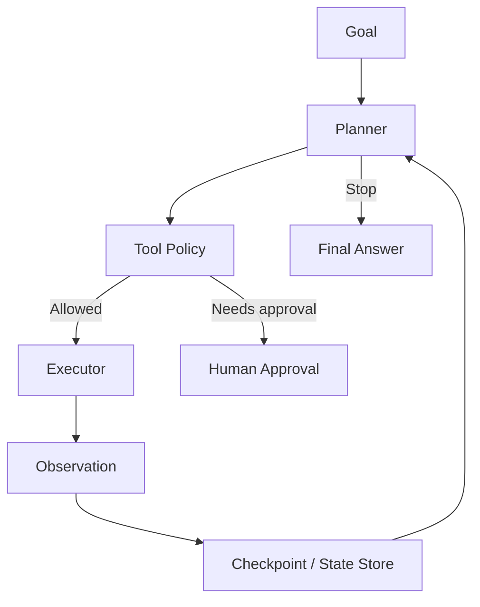

# Level 3：Agent 設計指南

> 最後更新：2026-04-26
> 相關論文：[ReAct](https://arxiv.org/abs/2210.03629)、[MemGPT](https://arxiv.org/abs/2310.08560)、[A Survey on LLM-based Autonomous Agents](https://arxiv.org/abs/2308.11432)

## 概覽與設計動機
從學習路徑來看，Level 3 的重點不是再多認識一個新名詞，而是理解什麼情況下「把 LLM 包進工作流」才真的值得。當任務只需要單輪摘要或翻譯時，直接呼叫模型通常最便宜；但只要任務開始依賴搜尋、工具、副作用、重試、狀態恢復與人工審批，系統的核心問題就不再是文本生成，而是控制流。Agent 設計要解決的正是這個問題：如何讓模型在可控邊界內成為決策器，而不是讓它直接接管整個系統。

對 openclaw 這類工具型系統尤其如此。你真正需要設計的，不只是 prompt，而是 planner、state store、tool policy、memory retrieval、approval gates 與 failure recovery 之間如何配合。也因此，好的 agent 設計不應該追求「越自主越好」，而是追求在成本、可觀測性與安全性之間找到穩定平衡。

## 核心機制深度解析

### 關鍵名詞與專案拆解

| 名詞 / 專案 | 它解決什麼問題 | 核心機制 | 與相鄰技術差異 | 何時適合 / 不適合 |
|-------------|----------------|----------|----------------|-------------------|
| Planner | 長任務容易迷航 | 將目標拆成可執行子步驟 | 比單輪 ReAct 更偏全域規劃 | 適合研究與報告生成；不適合低延遲場景 |
| Executor | 把抽象計畫落成工具操作 | 逐步執行並收集 observation | 比傳統 worker 更需要理解語意上下文 | 適合多工具流程；不適合無狀態簡單任務 |
| Working Memory | 保留本輪所需狀態 | 把當前任務上下文放在短期記憶 | 比 long-term memory 更快但更小 | 適合單次流程；不適合長期記憶 |
| Episodic / Semantic Memory | 記住過去事件與事實 | 事件流 + 向量檢索或結構化儲存 | 比 chat history 更可查詢 | 適合跨 session agent；不適合未治理的個資場景 |
| Approval Gate | 防止高風險副作用誤執行 | 在危險操作前中斷等待人工批准 | 比單純 denylist 更細粒度 | 適合寫檔、刪檔、發送訊息；不適合全自動高頻流程 |

### 控制流程
成熟的 agent runtime 通常是這樣運作：

1. 接收目標，建立初始狀態與停止條件。
2. 從工作記憶與歷史任務中檢索可用資訊。
3. 由 planner 提出下一步行動與其理由。
4. 經過 tool policy 驗證是否允許執行。
5. 執行工具並取得 observation。
6. 將 observation 與錯誤寫入狀態，必要時持久化 checkpoint。
7. 若結果不滿足停止條件，則 replan；否則輸出結果並關閉流程。

### 一個常見的記憶評分函數
Agent 從長期記憶取回哪些項目，常用加權評分來決定：

$$
score = \alpha \cdot relevance + \beta \cdot recency + \gamma \cdot importance
$$

這個式子代表：與任務最相似的記憶不一定最值得回來，因為安全事件與最近狀態常常更重要。對工程師來說，這直接影響 recall quality、token 成本與錯誤恢復能力。

### 架構圖


## 與前代技術的比較

| 技術 | 優點 | 限制 | 適用場景 |
|------|------|------|----------|
| ReAct-style agent | 設計簡單、互動自然 | 長任務穩定性有限 | 小型工具任務 |
| Plan-and-Execute agent | 更適合長任務 | token 成本高、延遲高 | 研究、規劃、報告 |
| Durable workflow agent | 可恢復、可審計 | 設計複雜、需要狀態基礎設施 | 生產級自動化 |
| 純 workflow engine | 高可控、好測試 | 對未知問題不夠彈性 | 固定流程企業系統 |

## 工程實作

### 環境設定
```bash
python -m venv .venv
source .venv/bin/activate
pip install --upgrade pip
```

### 核心實作（完整可執行）
```python
from __future__ import annotations

import json
from dataclasses import asdict, dataclass, field
from pathlib import Path


@dataclass
class AgentState:
  goal: str
  completed_steps: list[str] = field(default_factory=list)
  observations: list[str] = field(default_factory=list)


def search_docs(query: str) -> str:
  return f"docs search result for: {query}"


def write_report(text: str) -> str:
  return f"report written: {text[:30]}..."


TOOLS = {
  "search_docs": search_docs,
  "write_report": write_report,
}


def plan(state: AgentState) -> list[tuple[str, str]]:
  if not state.completed_steps:
    return [("search_docs", state.goal)]
  return [("write_report", "Summarize findings into a report")]


def requires_approval(tool_name: str) -> bool:
  return tool_name == "write_report"


def checkpoint(state: AgentState, file_path: Path) -> None:
  file_path.write_text(json.dumps(asdict(state), ensure_ascii=False, indent=2), encoding="utf-8")


def run_agent(goal: str, approved: set[str]) -> AgentState:
  state = AgentState(goal=goal)
  checkpoint_file = Path("agent_state.json")

  for tool_name, payload in plan(state):
    if requires_approval(tool_name) and tool_name not in approved:
      state.observations.append(f"blocked: {tool_name} requires approval")
      checkpoint(state, checkpoint_file)
      return state

    observation = TOOLS[tool_name](payload)
    state.completed_steps.append(tool_name)
    state.observations.append(observation)
    checkpoint(state, checkpoint_file)

  for tool_name, payload in plan(state):
    if requires_approval(tool_name) and tool_name not in approved:
      state.observations.append(f"blocked: {tool_name} requires approval")
      checkpoint(state, checkpoint_file)
      return state

    observation = TOOLS[tool_name](payload)
    state.completed_steps.append(tool_name)
    state.observations.append(observation)
    checkpoint(state, checkpoint_file)

  return state


if __name__ == "__main__":
  print(run_agent("collect best practices for agent safety", approved={"search_docs"}))
  print(run_agent("collect best practices for agent safety", approved={"search_docs", "write_report"}))
```

### 最小驗證步驟
```bash
python level3_agent_design_demo.py
cat agent_state.json
```

### 預期觀察
- 第一次執行只批准 `search_docs` 時，流程應停在 `write_report` 前並留下 checkpoint。
- 第二次執行批准 `write_report` 後，流程應完成並更新 `agent_state.json`。
- 狀態檔案應包含 `completed_steps` 與 `observations`，方便恢復與審計。

### 工程落地注意事項
- **Latency**：多一步 planner 或 approval 都會增加整體完成時間，但可換取穩定性。
- **成本**：durable workflow 的代價不是只有 token，還包括 state store、logging 與 replay 成本。
- **穩定性**：真正的失敗大多發生在 tool boundary，而不是模型文字品質本身。
- **Scaling**：當 agent 變成多 worker 或多 session 系統時，trace、checkpoint、permissions 與 evaluation 需要先成為基礎設施。

## 2025-2026 最新進展
最新 agent 研究與實務有兩個清楚方向。第一，agent evaluation 逐漸變成獨立主題，焦點從「跑出 demo」轉向「如何知道它可靠」。第二，runtime 開始明顯走向 stateful、durable、observable，這意味著 agent 設計越來越像分散式系統，而不是 prompt 工程的附屬品。

## 已知限制與 Open Problems
長期規劃、失敗恢復與安全邊界仍是 agent 設計最難的部分。很多系統可以在 happy path 表現亮眼，但一旦 observation 錯、工具 timeout、外部資料被污染，模型常常無法穩定修正。這也是為什麼 agent 設計不能只問「會不會用工具」，而必須問「失敗時怎麼停、怎麼記、怎麼恢復」。

## 自我驗證練習
- 練習 1：在範例中加入第三個高風險工具，設計不同 approval policy。
- 練習 2：讓 `plan` 根據上一輪 observation 重新規劃，觀察 replan 何時會失控。
- 練習 3：為 `agent_state.json` 設計版本欄位，思考 workflow 升級時如何兼容舊狀態。

## 延伸閱讀
- [來源清單](../docs/references/level3-agent-design-ref.md)

---
*此文件由 AI agent 自動生成並持續更新*

## 更新記錄
- 2026-04-26：重寫 Level 3 Agent 設計文件，補上 planner/executor/state store/approval gate 架構、可執行 checkpoint 範例與工程 trade-off。
