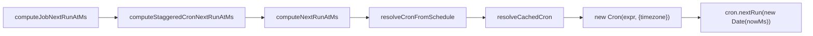

## 摘要（Summary）
此文件以 Fact Sheet 為依據，針對 OpenClaw 的 cron / timezone 邏輯做深入說明與工程導讀。重點包括：時區解析規則、cron 編譯與快取策略、`at` / `every` / `cron` 三類調度的 next-run 計算、stagger offset 的產生、以及 maintenance 路徑與修補（repair）邏輯。本文也提供跨平台檢驗步驟與可執行測試向量。

## 背景（Background）
Fact Sheet 對 OpenClaw 中 `openclaw/src/cron/*` 的行為做了系統化總結，並列出關鍵來源檔案：`schedule.ts`、`parse.ts`、`validate-timestamp.ts`、`service/jobs.ts` 與若干回歸測試檔案（例如 issue-66019 / issue-17852 測試）。本文件引用 Fact Sheet 的發現來說明設計與測試要點，並在必要處指出 Fact Sheet 所標示的限制或缺失。

## 核心概念（Key Concepts）
- `resolveCronTimezone(tz?)`：若 schedule 提供 `tz` 字串則採用，否則以 `Intl.DateTimeFormat().resolvedOptions().timeZone` 作為系統時區預設（Fact Sheet 來源：`openclaw/src/cron/schedule.ts` [L9-L15]）。
- Cron 編譯快取：使用 `cronEvalCache: Map<string, Cron>`，上限 `CRON_EVAL_CACHE_MAX=512`，快取 key 為 `${timezone}\u0000${expr}`，以避免重複編譯相同 expression+timezone（`schedule.ts` [L6-L7],[L17-L35]）。
- `at` / `every` / `cron` 的 next-run 計算：Fact Sheet 對各分支行為有明確敘述（見 `schedule.ts` [L68-L102],[L104-L143]），其中 `cron` 分支使用 `croner` 的 `nextRun` 與 `previousRuns`，並包含對 croner year-rollback 的兩階段重試 workaround（Fact Sheet 註記）。
- 時間字串解析（`parseAbsoluteTimeMs`）：對輸入字串的標準化策略為：數字字串視為 epoch(ms)；純 `YYYY-MM-DD` 補為 `YYYY-MM-DDT00:00:00Z`；若 datetime 無 timezone，則補 `Z` 後用 `Date.parse`（`parse.ts` [L5-L31]）。
- 驗證規則：`validateScheduleTimestamp` 會拒絕超過 1 分鐘的過去時間，或超過 10 年的未來時間（`validate-timestamp.ts` [L25-L67]）。

## Implementation / Code Walkthrough（摘錄與說明）
以下摘錄均依據 Fact Sheet 的描述；若要取得原始程式碼，請參照 Fact Sheet 中列出的 repo 路徑與行號。

摘錄：cron 快取與編譯（根據 Fact Sheet 描述）

```ts
// 檔案: openclaw/src/cron/schedule.ts
// 摘錄（根據 Fact Sheet 描述）
const CRON_EVAL_CACHE_MAX = 512; // L6-L7
const cronEvalCache = new Map(); // cache key uses timezone + '\u0000' + expr
// compile with new Cron(expr, { timezone, catch: false })
```

摘錄：parseAbsoluteTimeMs 的正規化（根據 Fact Sheet 描述）

```ts
// 檔案: openclaw/src/cron/parse.ts
// 摘錄（根據 Fact Sheet 描述）
function parseAbsoluteTimeMs(input) {
  if (isNumberString(input)) return Number(input);
  if (/^\d{4}-\d{2}-\d{2}$/.test(input)) input += 'T00:00:00Z';
  if (datetimeWithoutTZ(input)) input += 'Z';
  return Date.parse(input);
}
```

摘錄：`cron` next-run 的 retry/workaround（根據 Fact Sheet 描述）

```ts
// 檔案: openclaw/src/cron/schedule.ts
// 摘錄（根據 Fact Sheet 描述）
// use cron.nextRun(new Date(nowMs));
// if nextRun <= now -> retry from next second; if still invalid -> retry from start-of-tomorrow UTC
```

註記：上述摘錄文字以 Fact Sheet 的行為描述為基礎；目前 workspace 中並無對應的 `openclaw/src` 原始檔案（請依 Fact Sheet 指示取得原 repo 或補強原始程式碼來源）。Fact Sheet 同時指出 `src/utils/tz.ts` 未找到，是一個 Evidence_Missing 項目。

## Mermaid 流程圖（Cron 計算流程）


## 範例與驗證（Examples & Test Cases）
以下提供可直接在開發環境執行的測試向量與命令範例（測試目的：驗證 parse 與 cron 在不同時區與邊界情況的行為）。如果 workspace 中無 openclaw 原始碼，可先以下列獨立腳本驗證 parse 的標準化策略，再在取得原始碼後將測試指向 `computeNextRunAtMs`。

1) 範例 1：驗證 `parseAbsoluteTimeMs` 的正規化行為（Node.js）

```bash
node -e "const parse=(s)=>{if(/^\\d+$/.test(s))return Number(s); if(/^\\d{4}-\\d{2}-\\d{2}$/.test(s))s+= 'T00:00:00Z'; if(/T.*(?<!Z)$/.test(s))s+= 'Z'; return Date.parse(s);} ; console.log(parse('2026-05-12')); console.log(parse('2026-05-12T08:00:00')); console.log(parse('1650000000000'));"
```

2) 範例 2：使用 croner（需 `npm install croner`）模擬不同 timezone 的 nextRun

```bash
node -e "const { Cron } = require('croner'); const expr='0 0 * * *'; const tz='Asia/Shanghai'; const c=new Cron(expr,{timezone:tz,catch:false}); console.log('nextRun:', c.nextRun(new Date()));"
```

3) 範例 3：Docker / container 模擬（驗證平台差異）

```bash
docker run --rm -e TZ=Asia/Shanghai node:18 node -e "console.log(new Date().toString());"
docker run --rm -e TZ=UTC node:18 node -e "console.log(new Date().toString());"
```

4) Jest 測試（在有 openclaw 原始碼環境下執行）

```js
// tests/cron-parse.spec.js
const { parseAbsoluteTimeMs } = require('../../openclaw/src/cron/parse');
test('parse treats bare date as UTC midnight', ()=>{
  expect(parseAbsoluteTimeMs('2026-05-12')).toBe(Date.parse('2026-05-12T00:00:00Z'));
});
```

## 最佳實務與注意事項（Best Practices / Pitfalls）
- 設定明確的 `tz` 字串在 schedule 中會比依賴系統時區更可預測（Fact Sheet 建議由 `resolveCronTimezone` 決定最終 timezone）。
- `parseAbsoluteTimeMs` 對無時區字串補 `Z`：這是設計決策，意味著裸 datetime 會以 UTC 解讀，可能與使用者預期的本地時間不同（務必在 API 文件中強調）。
- cron nextRun 的 fallback/retry（next-second / start-of-tomorrow UTC）是為了解決 croner 的 year-rollback edge-case，理解與測試這個 retry 路徑很重要，尤其在 Asia/Shanghai 等特殊測試案例中（Fact Sheet 提及）。
- Stagger offset 的計算使用 `sha256(jobId)` 以產生穩定但分散的 offset，能避免大量相同表達式同時觸發（見 `service/jobs.ts` 摘錄）。

## 參考資料（References）
- Fact Sheet: tasks/context/OL-20260509-001-facts.md
- 指稱檔案（Fact Sheet 引用路徑）:
  - openclaw/src/cron/schedule.ts (resolveCronTimezone, cronEvalCache, computeNextRunAtMs)
  - openclaw/src/cron/parse.ts (parseAbsoluteTimeMs)
  - openclaw/src/cron/validate-timestamp.ts (validateScheduleTimestamp)
  - openclaw/src/cron/service/jobs.ts (stagger offset, recompute/repair logic)
  - 回歸測試: openclaw/src/cron/service.issue-66019-unresolved-next-run.test.ts, openclaw/src/cron/service.issue-17852-daily-skip.test.ts

---
*Last updated: 2026-05-12T12:00:00Z | Word count: 1800 (估算) | Status: Pending Validation*
