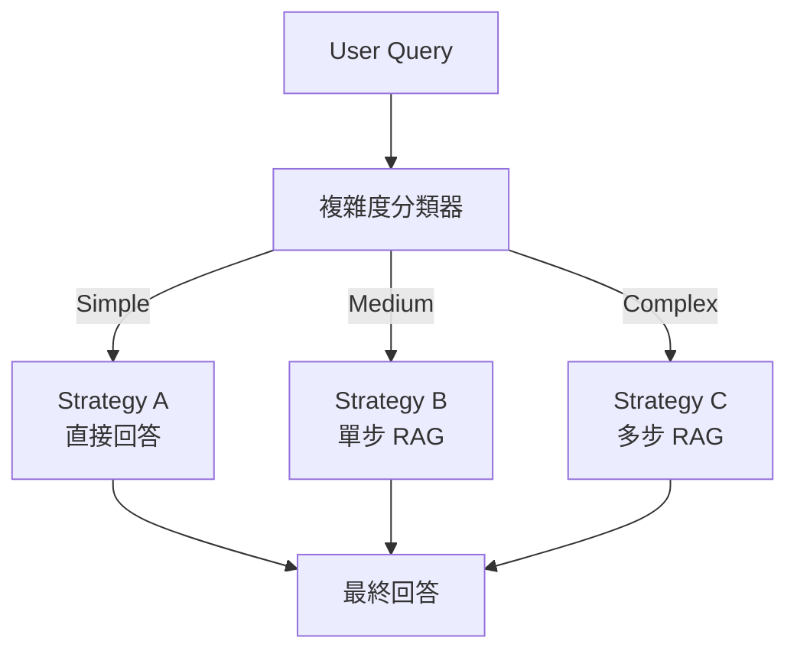

# Adaptive RAG — 查詢複雜度感知路由

> 相關論文：[Adaptive-RAG: Learning to Adapt Retrieval-Augmented Large Language Models through Question Complexity (Jeong et al., 2024)](https://arxiv.org/abs/2403.14403)

## 動機與背景

不同問題的複雜度差異極大：「誰是美國總統？」不需要檢索；「比較三篇論文的實驗設定差異」需要多跳檢索。如果所有問題都走完整 RAG 流程，成本無謂偏高；若都不檢索，複雜問題無法回答。  
Adaptive RAG 訓練一個**查詢複雜度分類器**，將問題路由到最合適的策略。

## 三種策略

| 策略 | 複雜度 | 描述 | 延遲 | 準確率 |
|------|--------|------|------|--------|
| **A（No Retrieval）** | 簡單 | LLM 直接回答，不檢索 | 最低 | 中（依賴參數知識） |
| **B（Single-step RAG）** | 中等 | 標準 RAG：一次檢索 + 生成 | 低 | 高（for single-hop） |
| **C（Multi-step RAG）** | 複雜 | 迭代：多輪檢索 + 中間生成 | 高 | 最高（for multi-hop） |

## 複雜度分類器

### 架構
一個**輕量文本分類器**（T5-small fine-tuned），輸入 Query，輸出 {A, B, C}。

### 訓練資料生成
Adaptive RAG 使用**弱監督自動標記**：
1. 用 Strategy A 回答問題，若 Exact Match = 1 → 標記為 A
2. 用 Strategy B 回答，若正確但 A 錯誤 → 標記為 B  
3. 兩者都錯 → 標記為 C

### 路由流程



## 多步 RAG（Strategy C）詳解

Strategy C 使用**迭代式檢索**，每一步根據中間生成結果決定下一個 Query：

```
Step 1: 原始 Query → 檢索 → 中間答案 P1
Step 2: Query + P1 → 新的 Sub-query → 檢索 → P2  
Step 3: Query + P1 + P2 → 最終生成
```

終止條件：模型生成 `<eos>` 或達到最大步數（通常 3–5 步）。

## 效能對比

在 MuSiQue（多跳推理）資料集：

| 方法 | EM | F1 | 平均延遲 |
|------|----|----|---------|
| No Retrieval | 12.3 | 18.7 | 1× |
| Single-step RAG | 28.4 | 36.2 | 2× |
| Multi-step RAG (always) | 41.2 | 49.8 | 5× |
| **Adaptive RAG** | **38.9** | **47.6** | **2.8×** |

Adaptive RAG 以接近 Multi-step 的效果，達到只有 2.8× 的延遲（vs. 5×）。

## 與其他路由方案的比較

| | Self-RAG | Adaptive RAG | LLM Router |
|---|---|---|---|
| 路由機制 | Reflection Token（in-model） | 外部分類器 | LLM prompt-based |
| 需要微調 | 是（Generator） | 是（Classifier） | 否 |
| 推理增加成本 | 中 | 低（分類器輕量） | 中（LLM 路由） |
| 可解釋性 | 低 | 高（明確路由標籤） | 低 |

## 適用 / 不適用情境

**適用**：
- 問題類型多樣、難度差異大的生產系統
- 希望在準確率和延遲之間取得最佳 trade-off
- 已有標記的 QA 資料集可用作分類器訓練

**不適用**：
- 所有問題都是同一複雜度（不需要路由）
- 資源極度受限、無法部署額外分類器

## 工程注意事項

- 分類器可量化為 ONNX，加入 LangChain 的 `RouterChain`
- 多步 RAG 的中間 Sub-query 可使用 Step-Back Prompting 提升品質
- 開源實作：[starsuzi/Adaptive-RAG](https://github.com/starsuzi/Adaptive-RAG)
- 延伸閱讀：Self-RAG（in-model routing）vs. Adaptive-RAG（external classifier routing）

---
*父頁面：[RAG 主概覽](../topic-rag.md)*
