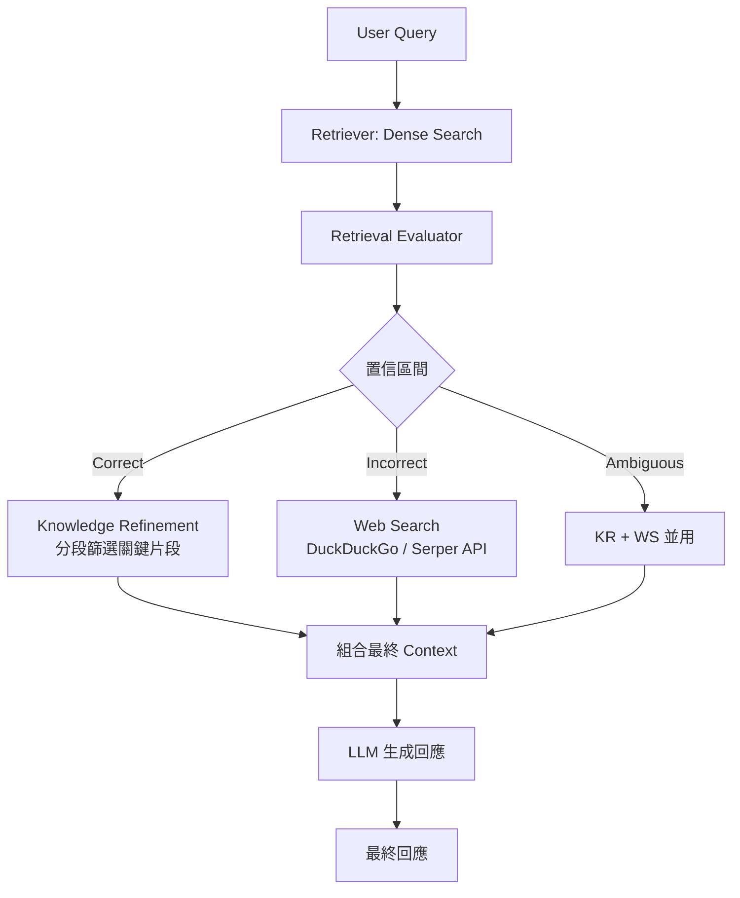

# CRAG — Corrective RAG（修正式檢索增強生成）

> 相關論文：[Corrective Retrieval Augmented Generation (Yan et al., 2024)](https://arxiv.org/abs/2401.15884)

## 動機與背景

標準 RAG 的弱點：檢索器可能返回**錯誤的、過時的、或不相關的文件**，LLM 若直接基於這些文件生成，反而比不檢索更差（Garbage-in, Garbage-out）。  
CRAG 的核心創新是在**生成之前**加入一個「**評估 + 修正**」步驟，透過自動判斷檢索品質，動態選擇修正策略。

## 核心機制

CRAG 引入一個輕量的**Retrieval Evaluator（檢索品質評估器）**，將每個檢索文件分為三個置信區間：

| 置信區間 | 判定條件 | 後續動作 |
|---------|---------|---------|
| **Correct** | 置信分數 > 上閾值 | 直接使用，進行 Knowledge Refinement |
| **Incorrect** | 置信分數 < 下閾值 | 捨棄，轉為 Web Search 補充 |
| **Ambiguous** | 介於兩閾值之間 | 兩者並用（Knowledge Refinement + Web Search） |

### 演算法流程

### Knowledge Refinement（知識精煉）

對 **Correct** 判定的文件，CRAG 進一步分段（strip-then-rerank），僅保留與 Query 最相關的句子，降低上下文長度與噪聲。步驟：
1. 將文件切成細粒度句子片段
2. 針對每段計算與 Query 的相關分數
3. 保留前 k 段，剔除不相關段落

## 訓練 Retrieval Evaluator

Evaluator 是一個**輕量二元分類器**（通常為 T5-large 或 BERT-base）：
- 輸入：`[Query, Retrieved Document]`
- 輸出：置信分數 $s \in [0, 1]$
- 訓練資料：使用 NQ、TriviaQA 等 QA 資料集，以 ROUGE / Exact Match 自動標記 Correct / Incorrect

上下閾值通常設定為：$\tau_{low} = 0.3$, $\tau_{high} = 0.7$

## 與 Naive RAG 的比較

| 面向 | Naive RAG | CRAG |
|------|-----------|------|
| 錯誤文件處理 | 直接使用 | 評估後修正或替換 |
| 動態知識來源 | 只用靜態向量庫 | 可跌回 Web Search |
| 額外元件 | 無 | Retrieval Evaluator + Web Search API |
| PopQA 準確率 | ~35% | ~45%（+10 pp） |
| 延遲 | 低 | 中（評估器 + 可選 Web Search） |

## 適用 / 不適用情境

**適用**：
- 知識庫可能包含過時資訊（動態新聞、法規更新）
- 對事實準確率要求高的應用（醫療、法律問答）
- 已有靜態向量庫但不確定其品質

**不適用**：
- 完全隔離的企業內網（無法呼叫外部 Web Search）
- 即時高吞吐量應用（評估器增加推理延遲）

## 工程注意事項

- Evaluator 可使用 ONNX 量化，推理延遲低於 50ms
- Web Search 可接入 SerpAPI、DuckDuckGo Search、Tavily 等服務
- 與 LangChain / LlamaIndex 整合：在 Retrieval 步驟後加入自定義 `NodePostprocessor`
- 開源 demo：[HuskyInSalt/CRAG](https://github.com/HuskyInSalt/CRAG)

---
*父頁面：[RAG 主概覽](../topic-rag.md)*
