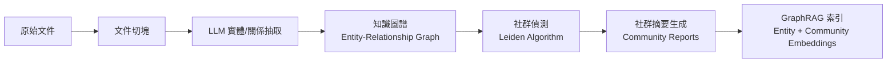
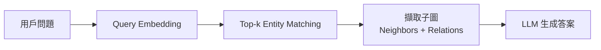
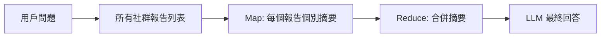

# GraphRAG — 圖結構多跳檢索增強生成

> 相關論文：[From Local to Global: A Graph RAG Approach to Query-Focused Summarization (Edge et al., Microsoft, 2024)](https://arxiv.org/abs/2404.16130)

## 動機與背景

傳統向量 RAG 只能在**局部、單跳**的語意相似性上檢索，對於需要**跨多個文件建立連結、推理因果關係、或整合全域知識**的問題效果差。  
GraphRAG 將文件轉化為**知識圖譜（Knowledge Graph）**，讓 LLM 能在圖的結構上進行多跳推理。

## 架構概覽

GraphRAG 分為兩大階段：

### 階段一：離線圖構建（Indexing）

### 階段二：線上查詢（Query Time）

#### Local Search（局部搜尋）
適合需要特定實體 + 鄰近關係的問題：

#### Global Search（全域搜尋）
適合需要跨整個語料庫綜合推理的問題：

## 關鍵技術元件

### 實體 + 關係抽取
使用 LLM（GPT-4 / Llama 3）從文件中抽取：
- **實體（Entity）**：人、組織、地點、概念
- **關係（Relation）**：實體間的有向邊，帶有語意描述

### 社群偵測（Community Detection）
使用 **Leiden Algorithm** 對圖進行分群，每個社群代表一個緊密相連的主題群集。為每個社群生成摘要（Community Report），作為 Global Search 的基本單位。

### 多跳推理能力

| 推理類型 | 範例問題 | 所需跳數 |
|---------|---------|---------|
| 單跳 | "誰是 OpenAI 的 CEO？" | 1 |
| 雙跳 | "GPT-4 的訓練資料涵蓋哪些語言的文獻？" | 2 |
| 多跳 | "比較 A 公司和 B 公司在某技術領域的合作夥伴網路" | 3+ |

## 與 Flat Vector RAG 的比較

| 面向 | Flat Vector RAG | GraphRAG |
|------|-----------------|---------|
| 知識結構 | 扁平向量 | 圖（節點 + 邊） |
| 多跳推理 | 有限 | 原生支持 |
| 全域摘要 | 無法 | Map-Reduce over Communities |
| 索引建立成本 | 低 | 高（LLM 抽取 + 圖構建） |
| 查詢延遲 | 低 | 中~高（Global Search 需多次 LLM 調用） |
| 典型場景 | FAQ、單文件摘要 | 知識圖譜、跨文件分析 |

## 適用 / 不適用情境

**適用**：
- 大型語料庫的全域問答（"整個文檔集裡，哪些主題最重要？"）
- 法律合同分析（跨條款推理）
- 科研文獻綜述（跨論文建立關係）

**不適用**：
- 簡單問答（成本過高）
- 實時更新語料（圖重建成本高）
- 無結構化語料（純數值資料）

## 工程注意事項

- 官方實作：[microsoft/graphrag](https://github.com/microsoft/graphrag)（Apache 2.0）
- 設定索引時，`chunk_size=300` + `overlap=100` 是常用起點
- 圖構建成本：約 100 頁文件需耗費 $1–5 美元（GPT-4 API）
- 與 Neo4j 整合：可將 Entity-Relation 匯出為 Cypher，使用 Neo4j 進行生產查詢
- 多模態擴展：[GraphRAG Multimodal (arXiv 2502.01457)](https://arxiv.org/abs/2502.01457) 支援圖像節點

---
*父頁面：[RAG 主概覽](../topic-rag.md)*
