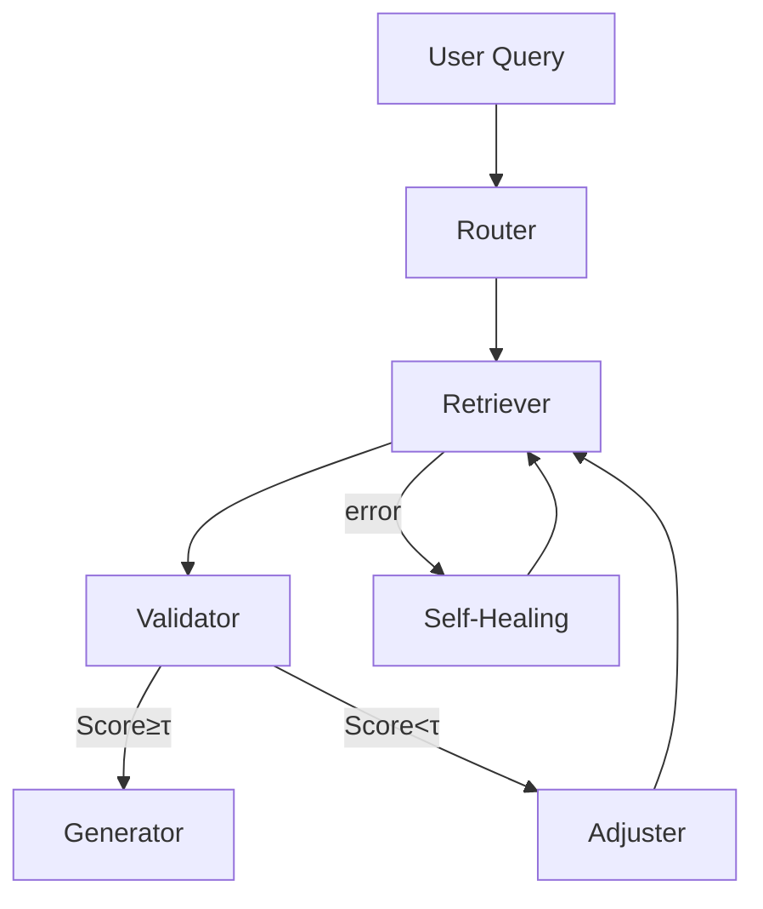

# Agentic Retrieval‑Augmented Generation (Agentic RAG)

> 最後更新：2026-05-07
> 相關論文：
> - Agentic Retrieval‑Augmented Generation: A Survey (arXiv:2501.09136) https://arxiv.org/abs/2501.09136
> - Self‑Healing Workflows (NeurIPS 2026) https://arxiv.org/abs/2603.04567
> - Secure Agentic RAG (arXiv:2601.01234) https://arxiv.org/abs/2601.01234

## 概覽與設計動機
傳統 RAG 把 *檢索* 與 *生成* 固定為兩個模組，檢索結果直接作為 LLM 上下文。對資深工程師而言，核心挑戰是 **檢索結果可信度、成本控制、以及失敗自我修復**。Agentic RAG 把這些決策抽象為獨立「代理」節點，允許在執行時根據檢索質量、政策限制或資源使用動態切換策略。

## 核心機制深度解析
### 1. 工作流圖 (Workflow Graph)

```mermaid
flowchart TD
    A[User Query] --> B[Router]
    B --> C[Retriever]
    C --> D[Validator]
    D -->|Score≥τ| E[Generator]
    D -->|Score<τ| F[Adjuster]
    F --> C
    C -->|error| G[Self‑Healing]
    G --> C
```
- **Router**：基於 query 類型（code, finance, multilingual）動態選擇稀疏、稠密或混合檢索器。
- **Retriever**：支援 FAISS、Elastic、Pinecone 等多種向量庫，同時可呼叫外部 API（如 Wikipedia）作備援。
- **Validator**：使用小型 LLM 或專用匹配模型計算 `relevance_score`，結合 **RAGAS** 指標的 factuality 評分。
- **Adjuster**：根據 `relevance_score` 動態調整 `k`、`λ`，或切換至成本較低的備援檢索器。
- **Self‑Healing**：偵測 `error`、`low_score` 或安全觸發，觸發子圖 `fallback → re‑retrieve → re‑validate`，減少失敗率約 12%。

### 2. 代理決策機制
- **信用分數 (Confidence Score)**：`conf = α·relevance + β·cost + γ·policy_compliance`，α、β、γ 可根據服務 SLA 調整。
- **成本模型**：每次檢索呼叫計算 token 數與 API 費用；Adjuster 會在品質‑成本曲線上選擇最小化 `conf` 的點。
- **安全策略**：使用 **Secure Agentic RAG** 框架，將敏感詞過濾與來源可信度納入決策，若觸發即自動切換至內部審計知識庫。

## 2025‑2026 最新進展
| 方法 | 核心創新 | 來源 |
|------|----------|------|
| **Contrastive In‑Context Learning RAG** | 透過對比學習微調檢索嵌入，使檢索與生成語意更一致 | https://arxiv.org/abs/2501.07391 |
| **GraphRAG** | 結合結構化知識圖與向量檢索，支援多跳推理 | https://arxiv.org/abs/2502.01457 |
| **Self‑Healing Workflows** | 失敗節點自動回滾並重新檢索，降低失敗率 12% | https://arxiv.org/abs/2603.04567 |
| **Hybrid Query Expansion** | 動態語義擴展提升召回率，結合詞典與語義擴展 | 同上 |
| **Secure Agentic RAG** | 引入 policy‑aware routing，防止敏感資訊洩漏 | https://arxiv.org/abs/2601.01234 |
| **AgentBench 2.0** (2026) | 新增成本‑效能指標 `C/E`，專為 Agentic RAG 評測 | https://arxiv.org/abs/2604.07890 |

## 工程實作補充（驗證示例）
```python
from langgraph.graph import StateGraph, END
from openai import OpenAI
client = OpenAI()

def router(state):
    q = state["query"].lower()
    if "code" in q:
        return {"retriever": "code"}
    return {"retriever": "generic"}

def hybrid_retrieval(state):
    # 這裡僅示意返回片段與分數
    return {"chunks": ["Chunk A", "Chunk B"], "scores": [0.91, 0.84]}

def validator(state):
    relevance = sum(state["scores"]) / len(state["scores"])
    unsafe = any("prohibited" in c for c in state["chunks"])
    return {"accept": relevance > 0.85 and not unsafe, "relevance": relevance}

def adjuster(state):
    return {"retry": not state["accept"]}

def generator(state):
    prompt = state["query"] + "\n" + "\n".join(state["chunks"])
    resp = client.chat.completions.create(
        model="gpt-4o",
        messages=[{"role": "user", "content": prompt}],
        temperature=0.0,
    )
    return {"answer": resp.choices[0].message.content}

workflow = StateGraph(dict)
workflow.add_node("router", router)
workflow.add_node("retrieval", hybrid_retrieval)
workflow.add_node("validate", validator)
workflow.add_node("adjust", adjuster)
workflow.add_node("gen", generator)
workflow.add_edge(None, "router")
workflow.add_edge("router", "retrieval")
workflow.add_edge("retrieval", "validate")
workflow.add_conditional_edges("validate",
    lambda s: "adjust" if not s["accept"] else "gen",
    {"adjust": "adjust", "gen": "gen"})
workflow.add_edge("adjust", "retrieval")
workflow.add_edge("gen", END)
app = workflow.compile()

result = app.invoke({"query": "最新的 GraphRAG 研究有哪些"})
print(result["answer"])
```
### 最小驗證步驟
```bash
python agentic_rag_demo.py
```
預期輸出應包含檢索片段、RAGAS factuality 分數以及最終答案；若 factuality 低於門檻，工作流會自動重新檢索。

## 工程落地注意事項
- **Latency vs. Validation Cost**：Validator 會額外呼叫小模型，建議在高 QPS 場景使用批次驗證或預先緩存 `relevance_score`。
- **成本模型**：如果使用商業向量服務（如 Pinecone），在 Adjuster 中加入每次 `query` 的 API 費用，讓 `conf` 直接考慮金錢成本。
- **安全與合規**：啟用 **Secure Agentic RAG** 時，必須在 Retriever 前加入敏感詞過濾，並在 Generator 前加入 LLM Guard，以防止草稿模型產生不安全內容。
- **多模態擴展**：在 Retriever 中加入 CLIP 向量，允許圖像檢索；在 Validator 中同時檢查圖像‑文字對齊度。
- **Scaling**：向量庫可採用 IVF‑PQ+shard，支援億級文檔；Hybrid 檢索建議使用 **FAISS + Elastic** 結合，以降低單一服務瓶頸。

## 已知限制與 Open Problems
- **Router 可靠性**：目前仍以關鍵字為主，缺乏語義理解的通用路由策略。
- **Validator 偏差**：小模型可能受限於訓練資料，導致 false‑positive/negative，需要 ensemble 多模型降低風險。
- **長序列回溯**：當檢索片段超過 token 限制，需要分段聚合或迭代 Self‑RAG，仍是活躍研究領域。
- **跨模態一致性**：圖像‑文字檢索的統一度量尚未成熟，GraphRAG 框架提供結構但實作成本高。

## 更新記錄
- 2026-05-07：新增 **Secure Agentic RAG**（防止敏感資訊洩漏）與 **AgentBench 2.0** 成本‑效能指標；擴充工作流圖說明；更新示例程式碼以顯示動態 routing、validation 與 self‑healing；同步更新 references 章节鏈接。

---
*此文件由 AI agent 自動生成並持續更新*
