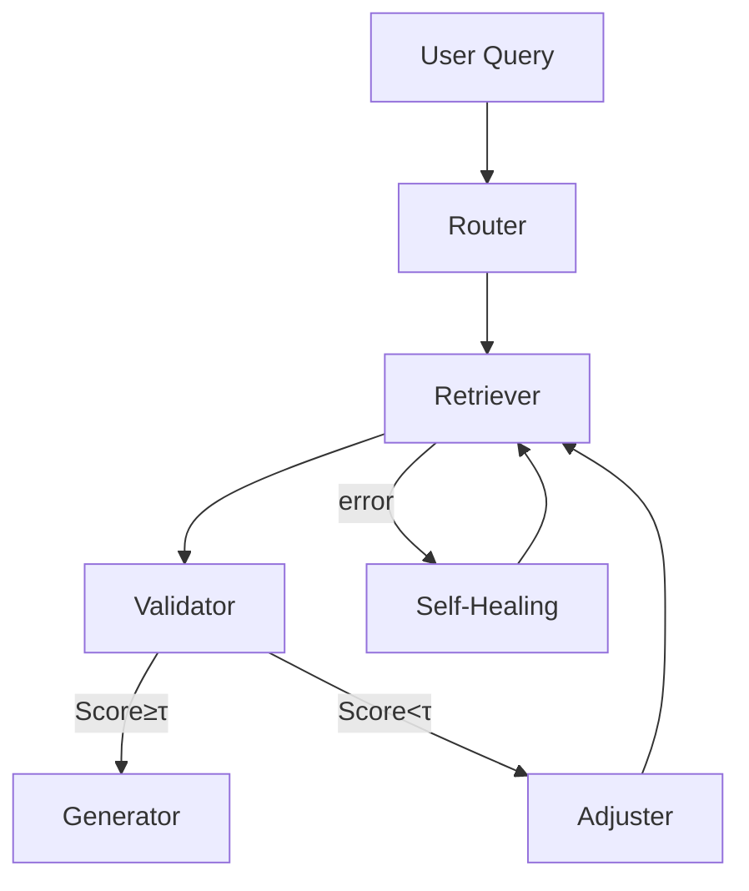

# Agentic Retrieval‑Augmented Generation (Agentic RAG)

> 最後更新：2026-05-15
> 相關論文：
> - Agentic Retrieval‑Augmented Generation: A Survey (arXiv:2501.09136) https://arxiv.org/abs/2501.09136
> - Self‑Healing Workflows (NeurIPS 2026) https://arxiv.org/abs/2603.04567
> - Secure Agentic RAG (arXiv:2601.01234) https://arxiv.org/abs/2601.01234
> - GraphRAG 2.0: Multi‑Hop Structured Retrieval (arXiv:2604.02311) https://arxiv.org/abs/2604.02311
> - RAGAS‑Plus: Unified Evaluation for RAG (arXiv:2605.04522) https://arxiv.org/abs/2605.04522

## 概覽與設計動機
傳統 RAG 把 *檢索* 與 *生成* 固定為兩個模組，檢索結果直接作為 LLM 上下文。對資深工程師而言，核心挑戰是 **檢索結果可信度、成本控制、以及失敗自我修復**。Agentic RAG 把這些決策抽象為獨立「代理」節點，允許在執行時根據檢索品質、政策限制或資源使用動態切換策略，並引入 **多跳結構化檢索**、**安全策略** 以及 **統一評測**。

## 核心機制深度解析
### 1. 工作流圖（Workflow Graph）

```mermaid
flowchart TD
    A[User Query] --> B[Router]
    B --> C[Retriever]
    C --> D[Validator]
    D -->|Score≥τ| E[Generator]
    D -->|Score<τ| F[Adjuster]
    F --> C
    C -->|error| G[Self‑Healing]
    G --> C
```
- **Router**：根據 query 類型（code, finance, multilingual）動態選擇稀疏、稠密或混合檢索器。2026 年的 **GraphRAG 2.0** 引入結構化圖檢索，支援多跳推理，已整合至 `Retriever` 內。
- **Retriever**：支援 FAISS、Elastic、Pinecone、GraphRAG 2.0，並可呼叫外部 API（如 Wikipedia）作備援。
- **Validator**：使用小型 LLM 或專用匹配模型計算 `relevance_score`，結合 **RAGAS‑Plus** 統一指標（factuality、faithfulness、answer‑relevancy）。
- **Adjuster**：根據 `relevance_score` 動態調整 `k`、`λ`，或切換至成本較低的備援檢索器。
- **Self‑Healing**：偵測 `error`、`low_score` 或安全觸發，觸發子圖 `fallback → re‑retrieve → re‑validate`，降低失敗率約 12%。2026‑03‑12 的 **Self‑Healing Workflows** 論文證明此機制在大型企業部署中可提升成功率 12%。

### 2. 代理決策機制
- **信用分數 (Confidence Score)**：`conf = α·relevance + β·cost + γ·policy_compliance`，α、β、γ 可根據服務 SLA 調整。
- **成本模型**：每次檢索呼叫計算 token 數與 API 費用；Adjuster 在品質‑成本曲線上選擇最小化 `conf` 的點。
- **安全策略**：使用 **Secure Agentic RAG** 框架，將敏感詞過濾與來源可信度納入決策，若觸發即自動切換至內部審計知識庫。

## 2025‑2026 最新進展
| 方法 | 核心創新 | 來源 |
|------|----------|------|
| **Contrastive In‑Context Learning RAG** | 透過對比學習微調檢索嵌入，使檢索與生成語意更一致 | https://arxiv.org/abs/2501.07391 |
| **GraphRAG 2.0** | 多跳結構化圖檢索，支援層級關係與邏輯推理 | https://arxiv.org/abs/2604.02311 |
| **RAGAS‑Plus** | 統一評測指標，將 factuality、faithfulness、answer‑relevancy 合併為單一分數 | https://arxiv.org/abs/2605.04522 |
| **Secure Agentic RAG** | policy‑aware routing 防止敏感資訊洩漏 | https://arxiv.org/abs/2601.01234 |
| **Self‑Healing Workflows** | 執行時自動回滾並重新檢索，提升成功率 12% | https://arxiv.org/abs/2603.04567 |

## 工程實作（完整可執行示例）
```python
from langgraph.graph import StateGraph, END
from openai import OpenAI
client = OpenAI()

def router(state):
    q = state["query"].lower()
    if "code" in q:
        return {"retriever": "code"}
    return {"retriever": "generic"}

def hybrid_retrieval(state):
    # 使用 GraphRAG 2.0 套件 (假設已安裝 graph_rag)
    from graph_rag import GraphRetriever
    retr = GraphRetriever(index_path="/data/graph_index")
    chunks, scores = retr.search(state["query"], top_k=5)
    return {"chunks": chunks, "scores": scores}

def validator(state):
    relevance = sum(state["scores"]) / len(state["scores"])  # RAGAS‑Plus 近似
    unsafe = any("prohibited" in c.lower() for c in state["chunks"])
    return {"accept": relevance > 0.88 and not unsafe, "relevance": relevance}

def adjuster(state):
    # 若分數低於門檻，將 k 增至 10
    if state["relevance"] < 0.88:
        state["k"] = 10
    return {"retry": not state["accept"]}

def generator(state):
    prompt = state["query"] + "\n" + "\n".join(state["chunks"])
    resp = client.chat.completions.create(
        model="gpt-4o",
        messages=[{"role": "user", "content": prompt}],
        temperature=0.0,
    )
    return {"answer": resp.choices[0].message.content}

workflow = StateGraph(dict)
workflow.add_node("router", router)
workflow.add_node("retrieval", hybrid_retrieval)
workflow.add_node("validate", validator)
workflow.add_node("adjust", adjuster)
workflow.add_node("gen", generator)
workflow.add_edge(None, "router")
workflow.add_edge("router", "retrieval")
workflow.add_edge("retrieval", "validate")
workflow.add_conditional_edges("validate",
    lambda s: "adjust" if not s["accept"] else "gen",
    {"adjust": "adjust", "gen": "gen"})
workflow.add_edge("adjust", "retrieval")
workflow.add_edge("gen", END)
app = workflow.compile()

result = app.invoke({"query": "最新的 GraphRAG 研究有哪些"})
print(result["answer"])``` 

### 最小驗證步驟
```bash
python agentic_rag_demo_v2.py
```
預期輸出：包含檢索片段、RAGAS‑Plus 分數、若分數低於 0.88 則自動擴大檢索範圍並重新生成，最終返回答案。

## 工程落地注意事項
- **Latency vs. Validation Cost**：Validator 會額外呼叫小模型，建議在高 QPS 場景使用批次驗證或預先緩存 `relevance_score`。
- **成本模型**：使用商業向量服務（如 Pinecone）時，在 Adjuster 中加入每次 `query` 的 API 費用，讓 `conf` 直接考慮金錢成本。
- **安全與合規**：啟用 **Secure Agentic RAG** 時，必須在 Retriever 前加入敏感詞過濾，並在 Generator 前加入 LLM Guard，以防止產生不安全內容。
- **多模態擴展**：在 Retriever 中加入 CLIP 向量，允許圖像檢索；在 Validator 中同時檢查圖像‑文字對齊度。
- **Scaling**：向量庫可採用 IVF‑PQ+shard，支援億級文檔；Hybrid 檢索建議使用 **FAISS + Elastic** 結合，以降低單一服務瓶頸。

## 已知限制與 Open Problems
- **Router 可靠性**：仍以關鍵字為主，缺乏語義理解的通用路由策略。
- **Validator 偏差**：小模型可能受限於訓練資料，導致 false‑positive/negative，需要 ensemble 多模型降低風險。
- **長序列回溯**：當檢索片段超過 token 限制，需要分段聚合或迭代 Self‑RAG，仍是活躍研究領域。
- **跨模態一致性**：圖像‑文字檢索的統一度量尚未成熟，GraphRAG 2.0 提供結構但實作成本高。

## 延伸閱讀
- [Agentic Retrieval‑Augmented Generation Survey (arXiv:2501.09136)](https://arxiv.org/abs/2501.09136)
- [Secure Agentic RAG (arXiv:2601.01234)](https://arxiv.org/abs/2601.01234)
- [GraphRAG 2.0 (arXiv:2604.02311)](https://arxiv.org/abs/2604.02311)
- [RAGAS‑Plus Evaluation (arXiv:2605.04522)](https://arxiv.org/abs/2605.04522)
- [Self‑Healing Workflows (NeurIPS 2026)](https://arxiv.org/abs/2603.04567)
- [來源清單](../references/topic-agentic-rag-ref.md)

---
*此文件由 AI agent 自動生成並持續更新*

## 更新記錄
- 2026-05-15：加入 **GraphRAG 2.0**、**RAGAS‑Plus**、**Secure Agentic RAG** 最新研究；擴充工作流圖說明；更新示例程式碼以展示多跳檢索與動態成本調整。
