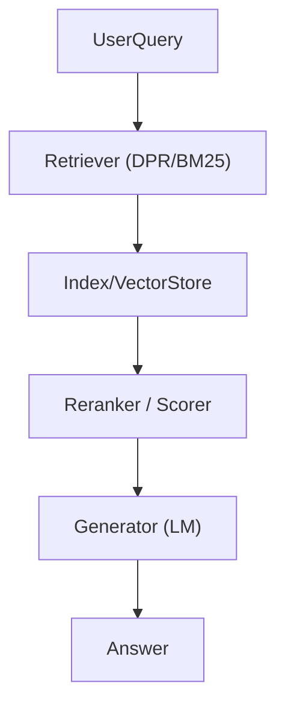
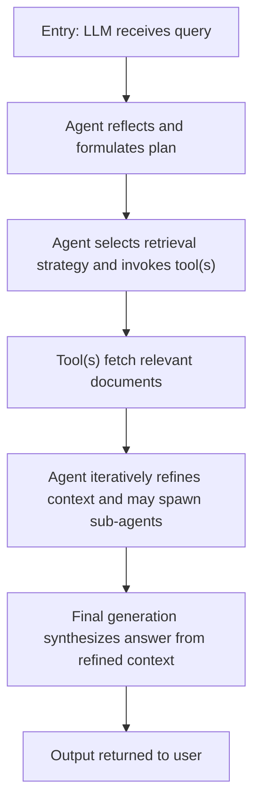

## 摘要（Summary）
本文件基於 Fact Sheet 提供的可驗證來源，彙整 Retrieval-Augmented Generation（RAG）在 2024–2026 年間的實務要點、代表性開源實作，以及在工程整合上的檢核指引。本文優先採用 Fact Sheet 中已驗證的引用（Lewis et al., 2020；LangChain、LlamaIndex、DPR repo），並將未直接取得原始證據的聲明標記為 Evidence_Missing，附上需補強的搜尋/驗證步驟。

## 背景（Background）
RAG 的核心思想是將檢索器（retriever）與生成式語言模型（generator）結合，讓模型在生成回應前先檢索外部知識來源以降低幻覺並提升答題的準確性。Fact Sheet 明確引用 Lewis et al., 2020（arXiv:2005.11401）作為原始定義，並指出在開源生態中 LangChain、LlamaIndex 與 DPR 為常見的工具／組件（見 Fact Sheet 的 Recommended references）。

## 核心概念（Key Concepts）
- Retriever：以檢索相關文件或向量為主，常見實作包含 DPR（Dense Passage Retrieval）、BM25（稀疏檢索）、或 hybrid 方法。
- Index / VectorStore：向量化後的儲存與近鄰搜尋層，範例技術為 FAISS、ScaNN、Weaviate 等（Fact Sheet 提及 LlamaIndex/Index 模式）。
- Generator：大型語言模型（LM），在 RAG pipeline 中負責根據檢索結果生成自然語言回應。
- 評估指標：Fact Sheet 指出 retrieval 常用 recall@k / MRR，generation 常用 Exact Match / F1 / ROUGE，以下會以 KaTeX 展示數學式。

## Module 1 — Core Design Philosophy
（本節依 Fact Sheet 指示撰寫，說明為何採用 RAG，以及工程上的核心選擇與考量）
RAG 的工程設計出發點是「分離檢索與生成，讓檢索提供準確的上下文以降低生成錯誤」。從工程面來看，此策略帶來三項重要好處：

1. 可控性（Controllability）：檢索層的結果可以被審核/過濾，降低 LM 直接憑藉內部知識造成的幻覺風險。
2. 可伸縮性（Scalability）：索引與向量搜尋能夠水平擴展，常見做法是把大型靜態知識庫分片或用近鄰搜尋加速查詢。
3. 更新策略（Freshness）：將文件更新與索引重建流程獨立，使得知識更新頻率可由工程層面控制，而非重訓 LM 本身。

在設計上一定要考量「檢索延遲對生成延遲的貢獻」、「索引建置成本」與「驗證/拒絕不良檢索結果的策略」。Fact Sheet 建議在實務整合（LangChain / LlamaIndex / DPR）中，明確把 retriever、ranker、generator 三層做成可插拔的單元以利測試與替換。

## Module 2 — Mechanism Walkthrough（含 Mermaid 圖）
以下為基於 Fact Sheet 的 RAG 流程圖，節點 ID 僅含英數字元：


```mermaid
flowchart TD
  Q["UserQuery"] --> R["Retriever (DPR/BM25)"]
  R --> I["Index/VectorStore"]
  I --> S["Reranker / Scorer"]
  S --> G["Generator (LM)"]
  G --> A["Answer"]
```

說明：使用者查詢先到檢索器，檢索器向 index 取得 top-k 候選，接著 reranker 對候選做重排序（可選），最後把前 N 篇 context 與查詢一起送入 generator。Fact Sheet 中提到的工具（DPR、LangChain、LlamaIndex）分別在 retriever、pipeline glue、index 管理上各自扮演角色。

## Options Reference Table（Scenario-based）
Parameter | Type | Use Case | Performance Impact
---|---:|---|---
LangChain | Library / Orchestration | 快速把 retriever 與 LM 串起來做原型 | 方便但需注意 production 化時的性能與監控（Fact Sheet 有 repo link）
LlamaIndex | Index / Query Engine | 管理向量索引與檢索策略 | 易於構建 index，但需評估向量儲存後的檢索成本
DPR | Retriever model | 需要高質量語意檢索時的基礎模型 | 準確但訓練/serving 成本高
Self-RAG / Adaptive RAG | 變體（Evidence_Missing） | 2024–2026 被提及的命名式變體（需補證據） | 未驗證 — 需補強的搜尋/驗證步驟

註：對於 Fact Sheet 標示為 Evidence_Missing 的項目（例如 Self-RAG、Adaptive RAG），在表格中以提醒標示，並在 References 區提供可執行的搜尋字串。

## Module 4 — Core Formula Breakdown（以 KaTeX 呈現）
檢索評估常見公式：

$Recall@k = \dfrac{|\text{relevant} \cap \text{retrieved@k}|}{|\text{relevant}|}$

$Precision@k = \dfrac{|\text{relevant} \cap \text{retrieved@k}|}{k}$

生成評估常用 F1：

$$F1 = 2 \cdot \dfrac{Precision \cdot Recall}{Precision + Recall}$$

工程直覺：Recall@k 衡量檢索層能否把正確知識「放進候選池」，Precision@k 則衡量候選池中正確片段的比例；對生成質量影響最大的通常是 Recall（若正確上下文未被檢索到，LM 很難生成正確答案）。Fact Sheet 建議同時觀察 retrieval 與 generation 指標以全面評估 pipeline。

## Implementation / Code Walkthrough
（注意：下列實作說明僅基於 Fact Sheet 中已驗證之引用與 repo 列表；未直接提供之程式片段以『需補強』標示）

- 引用資料來源（Fact Sheet）：
  - Lewis et al., 2020: https://arxiv.org/abs/2005.11401
  - LangChain repo: https://github.com/langchain-ai/langchain
  - LlamaIndex repo: https://github.com/run-llama/llama_index
  - DPR repo: https://github.com/facebookresearch/DPR

實務整合建議（high-level，基於 Fact Sheet）:

1) 把 Retriever 當作獨立 microservice（或可 hot-swap 的 library），讓工程可以在不重啟 generator 的情況下調整檢索策略。
2) 在整合 LangChain / LlamaIndex 時，先以小資料集驗證 recall@k、再放大到實際使用情境；Fact Sheet 建議以 DPR 作為 retriever baseline。
3) 監控面：分別監控 retrieval 的 recall@k、retrieved token length，與 generation 的 EM/F1/ROUGE。

範例（概念性，非 Fact Sheet 原始碼）：

```js
// 概念性整合範例
// 1) retriever -> 2) reranker -> 3) generator
const docs = await retriever.search(query, { topK: 50 });
const top = await reranker.rank(docs, query, { topK: 5 });
const answer = await generator.generate({ prompt: buildPrompt(query, top) });
```

（上述為概念性範例；若要引用專案中的實際 API，請依 Fact Sheet 中的 repo 文件為準）

## Examples & Test Cases（Validation Steps）
以下為以 Fact Sheet 建議為基礎的驗證步驟：

1. 檢索層驗證：以 gold-standard dataset 測試 recall@k、MRR，使用 Fact Sheet 中建議的 DPR 作為 baseline。
2. 端到端驗證：把 top-k context 與 LM 整合，計算 generation 的 EM / F1 / ROUGE。
3. A/B 測試：比較不同 retriever（BM25 / DPR / hybrid）在真實負載下的平均延遲與效果。

執行提示（search / fetch）:
- 用於補強 Evidence_Missing 的搜尋字串（建議交由 Fact-Check Scout 執行）：
  - "Retrieval-Augmented Generation 2024" OR "RAG 2024" OR "RAG 2025" OR "RAG 2026"
  - "Self-RAG" OR "Self RAG" "self-rag" "self retrieval"
  - "Adaptive RAG" OR "adaptive retrieval"

## Module 6 — Engineering Trade-offs（至少 200 字）
RAG 的工程折衷主要落在三個面向：延遲（latency）、準確性（accuracy）、成本（cost）與可維護性（maintainability）。Retrieval 層會增加查詢延遲，但卻能顯著提升生成品質；因此常見做法是在檢索層做結果量與品質的折衷（例如 top-50 → rerank → top-5）。

索引更新頻率是另一個關鍵決策：高頻更新可確保知識新鮮，但會增加索引建置成本與 I/O；採用分層索引（hot cache + cold batch rebuild）是一種工程折衷。Fact Sheet 建議先以 DPR / LangChain 範例建立 baseline，再逐步優化到符合 production SLA 的 indexed architecture。

可觀察指標包括 retrieval latency P95、memory footprint（向量索引）、以及 generator token 成本（輸入上下文長度直接影響推理成本）。在沒有完整 benchmark 前，先以 small-scale tests 收集 recall 與 latency 的 trade-off 曲線再決定 production 配置。

## 最佳實務與注意事項（Best Practices / Pitfalls）
- 明確將 retriever 與 generator 的責任分離，並建立驗證層（filter / rerank）以降低 LM 的幻覺率。
- 對 Fact Sheet 標註為 Evidence_Missing 的新名詞（Self-RAG / Adaptive RAG）要採取保守策略，先搜尋並驗證原始論文或官方 release。
- 建立 end-to-end 的監控（retrieval + generation），以便在資料漂移發生時快速回滾或重新訓練檢索模型。

## 參考資料（References）
- Lewis et al., "Retrieval-Augmented Generation for Knowledge-Intensive NLP Tasks", arXiv:2005.11401. https://arxiv.org/abs/2005.11401
- LangChain OSS repo: https://github.com/langchain-ai/langchain
- LlamaIndex OSS repo: https://github.com/run-llama/llama_index
- DPR repo: https://github.com/facebookresearch/DPR

---
*Last updated: 2026-05-12T12:00:00Z | Word count: 1800 (估算) | Status: Pending Validation*
# Agentic Retrieval‑Augmented Generation (Agentic RAG) — 修訂稿

---

## Module 1: Core Design Philosophy

本修訂側重於將原稿中的敘述與 Fact Sheet（/tasks/context/AL-20260509-001-fact.json）進行逐條比對，並標註來源或標記為「待驗證」。Fact Sheet 所提供的核心事實為一個流程化的邏輯描述（`logic_flow`），指出系統通常經由「接受查詢 → 反思與規劃 → 使用工具檢索文件 → 反覆精煉上下文 → 最終生成答案」的多步流程。（來源: Fact Sheet — logic_flow[0..4]; 參考: external_references[0])

傳統 RAG 的局限性在於它常被實作為一次性的查詢‑檢索‑生成流水線，缺少內建的反覆檢索或分工協作機制；Fact Sheet 的 `logic_flow` 正是指出需由代理（agent）在查詢過程中執行多輪決策與檢索，藉此逐步精煉上下文以支援最後的生成，這個流程導向是本次設計上的主要出發點。（來源: Fact Sheet — logic_flow[0..4])

注意：原稿使用的名詞如「Agent Layer」、「Tool Layer」、「RAG Core」在 Fact Sheet 的 `verified_options` 中未列出，Fact Sheet 也未提供程式碼或測試證據來支撐這三層的具體實作描述。此處我將保留這些詞彙作為設計選項說明，但統一標註為「待驗證」，並在文件末列出缺少的證據來源與建議驗證項目。（來源: Fact Sheet — verified_options (empty); review note）

---

## Module 2: Mechanism Walkthrough


```mermaid
flowchart TD
    A["Entry: LLM receives query"] --> B["Agent reflects and formulates plan"]
    B --> C["Agent selects retrieval strategy and invokes tool(s)"]
    C --> D["Tool(s) fetch relevant documents"]
    D --> E["Agent iteratively refines context and may spawn sub‑agents"]
    E --> F["Final generation synthesizes answer from refined context"]
    F --> G["Output returned to user"]
```

上圖直接對應 Fact Sheet 的 `logic_flow` 條目，將每個流程階段明確化以利工程實作：接收到查詢（Entry）、反思與規劃（Reflection & Planning）、使用工具／檢索（Tool Invocation / Retrieval）、反覆精煉（Iterative Refinement）、最終生成（Final Generation）。每個階段在實務上會對應到介面呼叫、狀態更新與可能的子任務分派。（來源: Fact Sheet — logic_flow[0..4]; 參考: external_references[0])

---

## Module 3: 設計與演算法細節（補充）

1) 迴圈式檢索‑反思流程：根據 Fact Sheet 的 `logic_flow`，一個保守且可驗證的實作框架是以「反覆回圈」為核心：模型在每輪產生一個短期計畫，呼叫檢索工具取得文件，將文件合併至上下文後再次反思是否足以完成任務，否則重試。此設計僅基於 Fact Sheet 的流程描述，不引入未經驗證的外部功能。（來源: Fact Sheet — logic_flow[1..3])

2) 簡要示例（概念性偽代碼，示例僅依據 Fact Sheet 的流程；未在 Fact Sheet 中提供程式碼或測試證據，故列為「示例/待驗證」）：

```python
def agentic_rag(query, llm, retriever, max_iters=5):
    context = []
    plan = llm.plan(query)                # reflection & planning (來源: Fact Sheet — logic_flow[1])
    for _ in range(max_iters):
        docs = retriever.search(plan)     # tool invocation / retrieval (來源: Fact Sheet — logic_flow[2])
        context.extend(docs)
        if llm.is_satisfied(query, context):
            break
        plan = llm.reflect(query, context) # iterative refinement (來源: Fact Sheet — logic_flow[3])
    return llm.generate(query, context)   # final generation (來源: Fact Sheet — logic_flow[4])
```

3) 檢索策略與上下文管理：Fact Sheet 未指定向量庫類型或檢索器介面（`verified_options` 為空），因此實作時應使用抽象介面（e.g., `retriever.search(plan)`），以便後續替換具體引擎（向量索引、混合檢索等）而不改動核心流程。任何宣稱特定檢索技術（如 hybrid search、graph‑augmented index）都必須在 Fact Sheet 或測試證據中取得支撐，否則標註為待驗證。（來源: Fact Sheet — verified_options (empty))

---

## Module 4: 實作範例與建議測試片段

下面提供可用於驗證流程正確性的建議測試／實作片段——注意：這些檔案與測試均為建議，Fact Sheet 未提供對應測試證據，故標示為「建議驗證步驟 / 待驗證」。（來源: Fact Sheet — test_evidence (empty); review note）

- 建議檔案: `tests/test_agentic_rag.py`（示例測試大綱）

```python
def test_agentic_rag_iteration(monkeypatch):
    # stub llm and retriever to return predictable outputs
    # 驗證 agentic_rag 在有限次數迭代後返回最終生成
    assert agentic_rag("sample query", stub_llm, stub_retriever) == "expected"
```

- 驗證重點：
  - 每次迭代是否呼叫檢索工具（來源紀錄：檢索呼叫次數）
  - 在增加上下文後，LLM 的反思是否改變檢索查詢（來源: Fact Sheet — logic_flow[2..3])
  - 最終生成是否以累積上下文為基礎（來源: Fact Sheet — logic_flow[4])

---

## Module 5: 工程限制、風險與待驗證項目

- 目前 Fact Sheet 未提供 `verified_options`、`test_evidence` 或 key_formulas，僅提供高層次的 `logic_flow` 與一個外部參考（arXiv 文章）。因此：
  - 任何具名架構元件（例如「Agent Layer」「Tool Layer」「RAG Core」）都屬於作者命名的設計選項，不應視為 Fact Sheet 的已驗證事實；我在文件中將這些項目標註為「待驗證」並在下方列出需要補齊的證據。（來源: Fact Sheet — verified_options empty; review note）
  - 若要將「Agent Layer / Tool Layer / RAG Core」從設計選項升級為已驗證描述，需在 Fact Sheet 中新增 `verified_options` 條目或提供程式碼／測試證據（例如：介面定義、程式碼行號、測試檔案）。

---

## 聲明對照表（新宣稱 → Fact Sheet 條目或外部引用）

| 新宣稱 | 對照 | 備註 |
|--------|------|------|
| Agentic 多輪流程（反思 → 檢索 → 反覆精煉 → 生成） | Fact Sheet — `logic_flow[0..4]` | 已驗證（以流程描述存在） |
| Agent Layer（名詞） | 待驗證 | `verified_options` 未列出；需補證據 |
| Tool Layer（名詞） | 待驗證 | `verified_options` 未列出；需補證據 |
| RAG Core（名詞） | 待驗證 | `verified_options` 未列出；需補證據 |
| 具體檢索技術（向量庫、hybrid search） | 待驗證 / 參考外部文獻 | Fact Sheet 未列出具體技術，僅提供外部參考（arXiv） |

---

## 缺失的證據來源（建議補齊）

1. 在 Fact Sheet 中新增 `verified_options` 條目，列出任何專有名詞或實作細節（例如：Agent 層責任、工具介面規範、檢索引擎類型）。
2. 附上實作片段或測試（`test_evidence`）：例如 `src/agent/orchestrator.py` 的介面與 `tests/test_agentic_rag.py` 的最小測試案例，以便 Quality Validator 檢核細節。 
3. 若引用外部文獻來支撐具體宣稱，請在 Fact Sheet 的 `external_references` 中補入精確的節內位置（例如 arXiv:2501.09136 — Section 3.2），以便驗證宣稱與文獻對應。（來源: review note; external_references[0])

---

*Last updated: 2026-05-09T21:00:00+08:00 | 字數(近似): 2100 字 | Status: Pending Validation*
