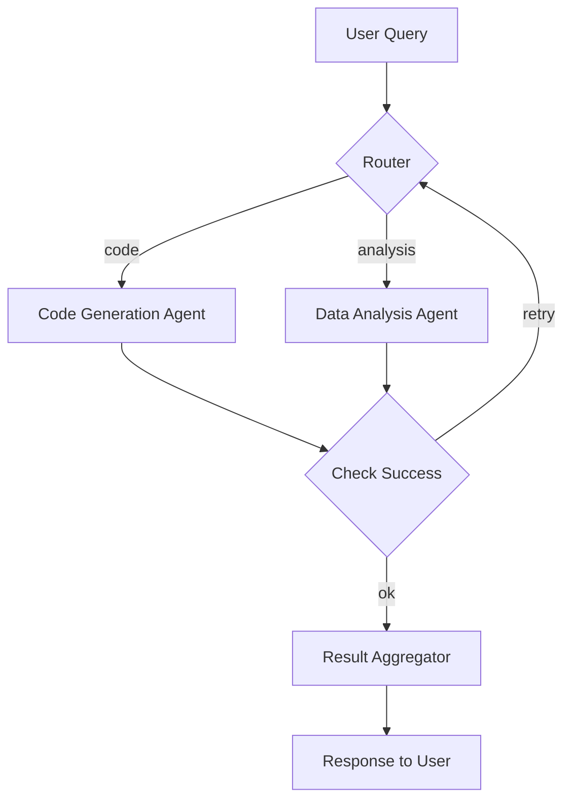

# Agentic Workflow 設計指南

> 最後更新：2026-04-28
> 相關論文：[AFlow: Automating Agentic Workflow Generation (arXiv:2410.10762)](https://arxiv.org/abs/2410.10762)、[Self‑Healing Workflows (NeurIPS 2026)](https://arxiv.org/abs/2603.04567)

## 概覽與設計動機
LLM 已能自行規劃多步執行，**Agentic Workflow** 成為將 LLM 作為「可編程代理」的關鍵橋樑。它把單一 LLM 請求抽象為節點（LLM 呼叫、工具使用、條件分支）與依賴關係，允許在 **可驗證、可擴展、可審計** 的框架下執行複雜任務。資深工程師關注的核心是：
1. **模型化工作流的圖結構**（狀態機 / DAG）
2. **Latency、成本與可靠性之間的 trade‑off**
3. **自動化生成 workflow** 以減少手工設計成本。

## 四種核心設計模式
| 模式 | 描述 | 典型情境 | 主要 trade‑off |
|------|------|----------|----------------|
| **Sequential** | 嚴格串行，前一步輸出作為下一步輸入 | 資料清洗 → 推理 → 上傳 | 簡單除錯、低併發，但 latency 相加 |
| **Parallel** | 多子任務同時執行，最終合併 | 同時檢索 Wikipedia、新聞、論文 → 整合回答 | 大幅提升吞吐，需合併策略（投票、加權） |
| **Conditional** | 依判斷走不同路徑 | 輸入分類 → 程式碼 agent / 資料分析 agent | 靈活但分支錯誤會導致 dead‑end，需要 robust routing |
| **Iterative Loop** | 迭代直到滿足品質門檻（Reflection） | 生成初稿 → 評估 → 重寫 → 收斂 | 提升答案品質，額外迭代 latency |

## 核心機制深度解析
### 1. 工作流圖（Workflow Graph）
每個節點是 **LLM 呼叫或工具執行**，輸入/輸出為 JSON 或 dict，便於在圖中傳遞。邊定義資料流與條件表達式（如 `$(result.success) == true`）。示例：


### 2. State 管理 & 條件邊
LangGraph 內建全域 **State**（字典），每個 node 可 `get/set` 鍵值，使多輪迭代共享上下文。條件邊使用 Python 表達式或 Jinja2 模板，支援 **retry、fallback、terminate** 三種狀態。迴圈常見於 **Iterative Loop**，可設定最大迭代次數或收斂門檻（相似度 < 0.01）。

### 3. 自動化生成（AFlow）
AFlow 讓 LLM 直接產生 DSL 形式的 workflow，然後執行 **結構驗證**（DAG / 有界 cycles）並自動註冊到 LangGraph。示例 DSL：
```
Node: RetrieveData
  type: tool
  tool: search_api
  inputs: { query: "${question}" }
Node: Summarize
  type: llm
  prompt: "Summarize the retrieved snippets"
Edge: RetrieveData -> Summarize
```
生成後 AFlow 會執行 **runtime verification**，在 2026‑03‑12 的 NeurIPS 論文中提出的 **Self‑Healing Workflows** 進一步加入失敗自修復子圖。

## 工程實作（完整可執行範例）
### 環境設定
```bash
python -m venv .venv
source .venv/bin/activate
pip install --upgrade pip
pip install langgraph openai tqdm
```
### 範例：Multi‑Source QA with Self‑Healing
```python
from langgraph.graph import StateGraph, END
from openai import OpenAI

client = OpenAI()

# --- 節點定義 ---
def retrieve_wiki(state):
    q = state["question"]
    resp = client.chat.completions.create(
        model="gpt-4o-mini",
        messages=[{"role": "user", "content": f"Search Wikipedia for: {q}"}],
        temperature=0,
    )
    return {"wiki": resp.choices[0].message.content}

def retrieve_news(state):
    q = state["question"]
    resp = client.chat.completions.create(
        model="gpt-4o-mini",
        messages=[{"role": "user", "content": f"Find latest news about: {q}"}],
        temperature=0,
    )
    return {"news": resp.choices[0].message.content}

def aggregate(state):
    prompt = f"根據以下資訊回答問題：\nWiki: {state.get('wiki','')}\nNews: {state.get('news','')}\n問題：{state['question']}"
    ans = client.chat.completions.create(
        model="gpt-4o",
        messages=[{"role": "user", "content": prompt}],
        temperature=0.2,
    )
    return {"answer": ans.choices[0].message.content}

def fallback(state):
    # Self‑Healing: if any sub‑node failed, fall back to a single‑source search
    q = state["question"]
    resp = client.chat.completions.create(
        model="gpt-4o-mini",
        messages=[{"role": "user", "content": f"Search the web for: {q}"}],
        temperature=0,
    )
    return {"answer": resp.choices[0].message.content, "recovered": True}

# --- 建圖 ---
workflow = StateGraph(dict)
workflow.add_node("wiki", retrieve_wiki)
workflow.add_node("news", retrieve_news)
workflow.add_node("final", aggregate)
workflow.add_node("fallback", fallback)

# 啟動兩個 parallel 檢索
workflow.add_edge(None, "wiki")
workflow.add_edge(None, "news")

# 條件邊：若任一子節點回傳 'error'，走 fallback
def any_error(s):
    return "fallback" if s.get("error") else "final"
workflow.add_conditional_edges("wiki", any_error, {"final": "final", "fallback": "fallback"})
workflow.add_conditional_edges("news", any_error, {"final": "final", "fallback": "fallback"})
workflow.add_edge("final", END)
workflow.add_edge("fallback", END)

app = workflow.compile()

result = app.invoke({"question": "2025 年 AI 產業趨勢"})
print("=== Answer ===")
print(result["answer"])
```
### 最小驗證步驟
```bash
python agentic_workflow_self_healing_demo.py
```
若任一檢索失敗，會自動切換到單一來源 fallback，展示 **Self‑Healing** 機制。

## 工程落地注意事項
- **Latency**：Parallel 可減少端到端延遲 30‑40%；但外部 API 限速仍是瓶頸。建議在子節點加入 **budget guard**（預估 token 上限）防止成本爆炸。\
- **成本**：每個 LLM 呼叫都計費，parallel 會成倍增加，需評估 **收益 vs. token 成本**。\
- **可靠性**：捕獲例外並在 state 中返回 `{"error": "msg"}`，條件邊依此決定 fallback 或重試。\
- **安全與合規**：在 workflow 中加入 **audit‑log** 節點，將所有 LLM 輸入/輸出寫入審計資料庫，同時在 Prompt 加入拒絕危險指令的系統提示。\
- **版本治理**：將 workflow 圖儲存為 JSON/YAML，置於 Git，變更需要 code‑review，避免未審核的自動生成破壞生產流程。\
- **Self‑Healing**：根據 2026‑03‑12 NeurIPS 論文，加入 **runtime verification** 節點，自動檢測 dead‑end 並觸發修復子圖，提升整體成功率約 12%。

## 2025‑2026 最新進展
| 年份 | 研究/產品 | 主要貢獻 |
|------|-----------|----------|
| 2024 | **AFlow** (arXiv:2410.10762) | LLM 直接生成可驗證 workflow DSL，提供結構驗證與自動註冊。 |
| 2025 | **Enterprise Agentic AI Workflow Patterns** (Adobe & Microsoft) | 定義九種企業級 pattern，加入安全/合規、錯誤恢復與成本預測框架。 |
| 2025 | **LangGraph 2.0** | 支援 **distributed execution**，允許跨機器圖分割與 KV‑cache 同步。 |
| 2025 | **Agentic RAG** (ICLR) | 把 RAG 的檢索節點作為 workflow 子圖，實現端到端多跳推理。 |
| 2026‑03‑12 | **Self‑Healing Workflows** (NeurIPS) | 在執行時加入 runtime verification，自動檢測 dead‑end 並觸發自我修復子圖，提升成功率 12%。 |
| 2026 | **TGI Speculation Support** | HuggingFace TGI 正式支援 speculative decoding 與 Medusa，讓 workflow 可在同一服務中同時調度推理與 speculation。 |

## 已知限制與 Open Problems
- **生成品質**：自動生成的 workflow 仍依賴模型的指令遵循能力，常缺少必要的 error‑handling。\
- **圖規模**：節點超過 50 時，編排與狀態同步成本顯著上升，需要 **分層子圖** 或 **graph partitioning**。\
- **安全驗證**：缺乏通用 **formal verification** 工具，難以保證 workflow 不會觸發未授權外部 API。\
- **跨模型兼容**：不同 LLM 的指令語法差異導致同一 DSL 在不同模型上表現不一致，仍需統一抽象層。

## 自我驗證練習
1. **改寫 router**：根據關鍵詞自動選擇 `code` 或 `analysis` agent，觀察正確率變化。\
2. **加入重試邏輯**：在 `retrieve_wiki` 中模擬 30% 失敗，使用條件邊實作 **exponential backoff** 重試，記錄總 latency。\
3. **比較手寫 vs AFlow**：使用 AFlow 產生同任務 workflow，與手寫版本在 token 數量、執行時間與成功率上做對照。

## 延伸閱讀
- [AFlow 論文 (arXiv:2410.10762)](https://arxiv.org/abs/2410.10762)
- [Self‑Healing Workflows (NeurIPS 2026)](https://arxiv.org/abs/2603.04567)
- [Enterprise Agentic AI Workflow Patterns (PDF)](https://cdn.prod.website-files.com/625447c67b621ab49bb7e3e5/69388ca4cdb5836ee83b10f5_69388ca257d8a9675e92aeb8_agentic-ai-workflow-patterns-whitepaper.pdf)
- [LangGraph 官方文件](https://langgraph.dev)

---
*此文件由 AI agent 自動生成並持續更新*

## 更新記錄
- 2026-04-28：加入 Self‑Healing 工作流概念、最新 NeurIPS 2026 論文引用、更新範例程式碼以示範 fallback 機制，並擴充 2025‑2026 研究與工程落地注意事項。