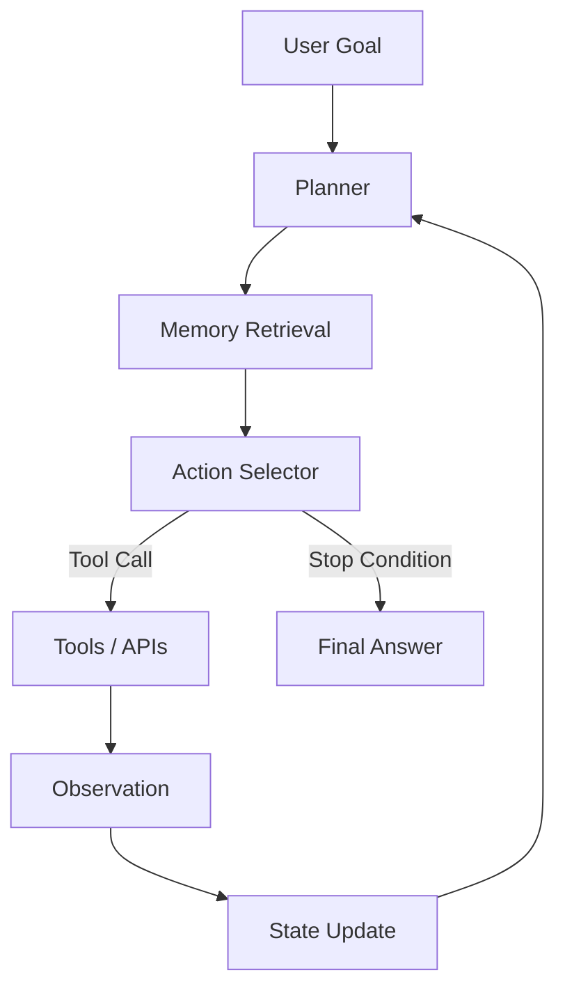

# AI Agent 設計與框架 (AI Agents)

> 最後更新：2026-04-26
> 相關論文：[ReAct](https://arxiv.org/abs/2210.03629)、[MemGPT](https://arxiv.org/abs/2310.08560)、[A Survey on LLM-based Autonomous Agents](https://arxiv.org/abs/2308.11432)

## 概覽與設計動機
AI Agent 不是「會聊天的 LLM」換一個名字，而是把語言模型包進一個可持續執行的控制迴圈。傳統 LLM 擅長單次生成，但它對外部世界的觀測能力有限、對長任務的狀態維護薄弱、對工具副作用缺乏原生保證，因此一旦任務需要搜尋、規劃、分步執行、狀態恢復與安全邊界，單次 prompt 很快就會失效。Agent 的設計動機，就是把「推理」從一次性文字生成，改造成一個可以讀取環境、決定下一步、執行工具、檢查結果，再更新內部狀態的閉環系統。

從研究演進來看，ReAct 把 reasoning trace 與 action interleaving 合在一起，解決了純 CoT 容易在沒有新證據的情況下持續幻覺的問題。之後的工作開始把規劃、記憶與工具調用拆成更清楚的模組，例如以 external memory 補足上下文長度限制、以 planner/executor 分工降低長任務失敗率、以 workflow runtime 提供中斷恢復與 human approval。到了 2025 年更新版 agent survey，產業與學術已逐漸收斂到一個共識：Agent 的關鍵不是讓模型「更像人」，而是讓系統在長流程中維持可追蹤性、可恢復性與可驗證性。

## 核心機制深度解析

### 關鍵名詞與專案拆解

| 名詞 / 專案 | 它解決什麼問題 | 核心機制 | 與相鄰技術差異 | 何時適合 / 不適合 |
|-------------|----------------|----------|----------------|-------------------|
| ReAct | 純推理缺乏外部證據，純 action 缺少理由 | 交錯輸出 Thought、Action、Observation | 比單純 CoT 多了環境互動；比 workflow engine 少了 durable state | 適合工具驅動問答與小型任務；不適合高風險長工作流 |
| Plan-and-Execute | 長任務會在中途迷航 | 先產生子任務，再逐步執行與重規劃 | 比 ReAct 更偏階層式；成本也更高 | 適合報告生成、研究任務；不適合低延遲即時回應 |
| Memory 系統 | context window 太短，無法記住長期資訊 | 分成 working memory、episodic memory、semantic memory | 比單次聊天多了外部儲存與檢索策略 | 適合多輪互動；不適合沒有資料治理的敏感場景 |
| MemGPT | 長上下文成本過高 | 以 OS 分層記憶概念在上下文與外部儲存之間 paging | 比一般向量記憶更強調虛擬上下文管理 | 適合長文與長期對話；不適合極低延遲任務 |
| Tool Router / Function Calling | 模型不知道何時該呼叫工具 | 用 schema 約束工具輸入輸出，模型只負責選擇與組合 | 比硬編碼 workflow 更彈性；比自由文字 action 更可驗證 | 適合生產環境；不適合沒有權限控管的直接執行 |

### 演算法流程
一個成熟的 Agent 控制迴圈，通常會包含以下步驟：

1. 接收目標與上下文，建立當前工作記憶。
2. 從長期記憶中檢索與任務最相關的事件、事實與過去失敗案例。
3. 由 planner 產生下一步候選行動，可能是直接回答、呼叫工具、拆分子任務或要求人工確認。
4. 若需要工具，先以 schema 或參數驗證器檢查輸入是否合法。
5. 執行工具，收集 Observation，並把結果寫回工作記憶。
6. 若 Observation 顯示失敗、衝突或不完整，觸發 replan 或 reflection。
7. 當停止條件成立時，輸出最終答案與必要的執行摘要。

### 記憶檢索的簡化數學
在工程實作中，記憶檢索通常不是單靠相似度，而是同時考慮語意相關性、時間衰減與重要度：

$$
score(m_i, q) = \alpha \cdot sim(m_i, q) + \beta \cdot recency(m_i) + \gamma \cdot importance(m_i)
$$

其中：

- $sim(m_i, q)$ 表示記憶 $m_i$ 與查詢 $q$ 的語意相似度。
- $recency(m_i)$ 表示近期事件的加權分數，避免系統只抓到很舊但語意接近的資訊。
- $importance(m_i)$ 表示記憶對任務是否關鍵，例如安全事件、使用者偏好或上一輪失敗原因。
- $\alpha, \beta, \gamma$ 是系統依場景調整的權重。

直觀上，這個式子解釋了為什麼「只是向量搜尋」還不夠。對 agent 來說，最相似的資訊不一定是最值得拿回上下文的資訊，因為有些任務更依賴最近狀態或高風險事件。

### 架構圖


## 與前代技術的比較

| 技術 | 優點 | 限制 | 適用場景 |
|------|------|------|----------|
| Agent | 可分步執行、可用工具、可維持狀態 | latency 高、失敗面積大、需要治理 | 長任務、自動化研究、流程編排 |
| 單次 LLM 呼叫 | 成本低、延遲低、易維護 | 沒有外部觀測、無 durable state | 單輪問答、摘要、改寫 |
| 傳統 workflow engine | 可預測、易測試、恢復能力強 | 對未知問題不靈活 | 固定流程、企業系統整合 |
| RAG-only assistant | 可用外部知識、幻覺較低 | 不能處理多步副作用操作 | 知識問答、文件搜尋 |

## 工程實作

### 環境設定
```bash
python -m venv .venv
source .venv/bin/activate
pip install --upgrade pip
```

### 核心實作（完整可執行）
```python
from __future__ import annotations

from dataclasses import dataclass, field
from datetime import datetime
from typing import Callable


@dataclass
class MemoryItem:
    text: str
    importance: float
    created_at: datetime = field(default_factory=datetime.utcnow)


@dataclass
class Tool:
    name: str
    description: str
    handler: Callable[[str], str]


def weather_tool(_: str) -> str:
    return "台北 27C，晴天，降雨機率 10%"


def calculator_tool(expression: str) -> str:
    allowed = set("0123456789+-*/(). ")
    if not set(expression) <= allowed:
        raise ValueError("unsafe expression")
    return str(eval(expression, {"__builtins__": {}}, {}))


def retrieve(memory: list[MemoryItem], query: str) -> list[MemoryItem]:
    keywords = set(query.lower().split())
    scored = []
    for item in memory:
        overlap = len(keywords & set(item.text.lower().split()))
        score = overlap + item.importance
        scored.append((score, item))
    return [item for score, item in sorted(scored, reverse=True)[:2] if score > 0]


def choose_action(goal: str) -> tuple[str, str]:
    lowered = goal.lower()
    if any(token in lowered for token in ["天氣", "weather"]):
        return ("weather", "taipei")
    if any(token in lowered for token in ["計算", "calculate", "+", "-", "*", "/"]):
        return ("calculator", goal.replace("計算", "").strip())
    return ("answer", "目前無需工具，直接根據已有資訊回答")


def run_agent(goal: str) -> str:
    memory = [
        MemoryItem("user prefers concise engineering answers", importance=1.2),
        MemoryItem("weather queries should use the weather tool", importance=2.0),
    ]
    tools = {
        "weather": Tool("weather", "fetch current weather", weather_tool),
        "calculator": Tool("calculator", "evaluate math", calculator_tool),
    }

    context = retrieve(memory, goal)
    action, payload = choose_action(goal)

    if action in tools:
        observation = tools[action].handler(payload)
        memory.append(MemoryItem(f"{action} -> {observation}", importance=1.5))
        return f"Goal: {goal}\nContext: {[item.text for item in context]}\nObservation: {observation}"

    return f"Goal: {goal}\nContext: {[item.text for item in context]}\nAnswer: {payload}"


if __name__ == "__main__":
    print(run_agent("請告訴我台北今天天氣"))
    print(run_agent("請計算 (12 + 30) / 7"))
```

### 最小驗證步驟
```bash
python agent_demo.py
```

### 預期觀察
- 第一個查詢應命中 weather tool，輸出 weather observation。
- 第二個查詢應命中 calculator tool，輸出正確算式結果 `6.0`。
- 若輸入包含危險字元，例如字母與底線混入算式，calculator tool 應拒絕執行。

### 工程落地注意事項
- **Latency**：每多一輪 tool call 或 reflection，都會放大整體延遲；對即時產品要限制最大步數。
- **成本**：planning、tool selection、replanning 各自都會消耗 token；multi-agent 架構更容易倍增成本。
- **穩定性**：失敗通常不是模型「不夠聰明」，而是 schema、狀態同步、工具 timeout、上下文污染沒有被治理。
- **Scaling**：當任務增長到多 session 或多 worker 時，必須把 memory、trace、approval 與 retry 政策獨立成基礎設施。

## 2025-2026 最新進展

### Survey-driven 標準化
2025 版更新的 autonomous agent survey 不再只列出框架名稱，而是把 agent 系統拆成 unified construction framework、應用場景、evaluation 與 future directions。這代表領域開始從 demo 驅動走向系統化比較，尤其關注長期規劃、評測與可靠部署。

### 記憶與持久化 runtime
MemGPT 之後，記憶不再只是「向量資料庫接一個檢索器」，而是朝向分層記憶、虛擬上下文與可恢復控制流發展。工程上這意味著 agent runtime 會更像作業系統，而不是單一 prompt template。

### 可驗證工具調用
生產系統越來越依賴 schema-constrained outputs、function calling 與 approval checkpoints，因為純自然語言 action 太難測試也太難治理。這類方法的價值不在於讓模型更聰明，而在於把失敗模式轉成可觀測、可攔截的系統事件。

## 已知限制與 Open Problems
Agent 依然有三個硬限制。第一，長期規劃仍然脆弱，模型很容易把局部成功誤判成全域進度。第二，記憶壓縮與檢索策略仍缺少穩定最優解，不同任務對 recency、relevance、importance 的權重很不一樣。第三，工具越多，權限與安全風險越大，尤其是 prompt injection、tool parameter abuse 與 observation poisoning 仍是開放問題。

## 自我驗證練習
- 練習 1：把範例中的 `choose_action` 擴充成三種工具，觀察工具選擇錯誤時的 failure mode。
- 練習 2：把 `retrieve` 的分數改成不同權重，測試相同查詢下記憶檢索結果如何變化。
- 練習 3：加入一個需要人工批准的危險工具，設計何時必須中斷等待使用者確認。

## 延伸閱讀
- [來源清單](../docs/references/topic-agents-ref.md)

---
*此文件由 AI agent 自動生成並持續更新*

## 更新記錄
- 2026-04-26：重寫 Agent 文件，補上 ReAct、記憶檢索數學、可執行 Python 範例、工程 trade-off 與 2025-2026 演進方向。
