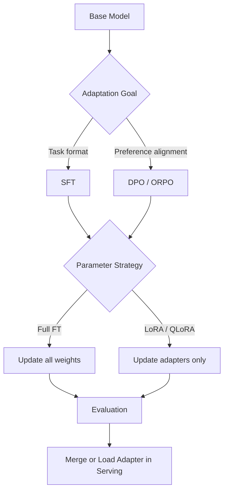

# Fine-tuning 與 Post-Training (LLM Adaptation)

> 最後更新：2026-04-26
> 相關論文：[LoRA](https://arxiv.org/abs/2106.09685)、[QLoRA](https://arxiv.org/abs/2305.14314)、[DPO](https://arxiv.org/abs/2305.18290)

## 概覽與設計動機
預訓練模型已經學到廣泛的語言分布，但這不代表它可以直接滿足特定產品、特定領域或特定行為邊界。Fine-tuning 與 post-training 的設計動機，就是把「會說話的基礎模型」轉成「在特定目標上可控、可部署、可維護的模型」。當任務需要領域語彙、企業內部格式、工具協作習慣、偏好對齊或安全風格時，只靠 prompt 往往不夠穩定，因為每次請求都要重複提供規則，且模型的內部表示並沒有真正被更新。

但 full fine-tuning 對大型模型來說很快就變得不切實際。除了訓練成本高，還有權重存儲、版本治理、回滾與多任務共存等問題。這也是 LoRA、QLoRA、PEFT 與 DPO 等方法變得重要的原因：它們讓工程團隊可以分別在參數效率、硬體成本、行為對齊與部署複雜度之間做出清楚取捨。對資深工程師而言，關鍵問題不是「要不要微調」，而是「哪一類 adaptation 最符合資料規模、硬體預算、上線風險與評測能力」。

## 核心機制深度解析

### 關鍵名詞與專案拆解

| 名詞 / 專案 | 它解決什麼問題 | 核心機制 | 與相鄰技術差異 | 何時適合 / 不適合 |
|-------------|----------------|----------|----------------|-------------------|
| Full Fine-tuning | 需要全面改寫模型行為 | 更新所有可訓練權重 | 最完整，但成本最高 | 適合大預算、強 domain shift；不適合資源受限團隊 |
| LoRA | full FT 太貴 | 將權重更新表示成低秩矩陣分解 $BA$ | 比 adapter 更輕，通常無額外推理延遲 | 適合多任務 adaptation；不適合需要大幅改動所有層 |
| QLoRA | LoRA 仍受限於 GPU 記憶體 | 在 4-bit quantized backbone 上訓練 LoRA adapters | 比 LoRA 更省記憶體，但訓練路徑更複雜 | 適合單卡或小集群微調；不適合極端數值敏感任務 |
| PEFT | 需要統一管理多種參數高效方法 | 抽象 LoRA、IA3、Prefix Tuning 等方法的配置與載入 | 比單點實作更可維護 | 適合產品化與多 adapter 管理；不適合只做一次性實驗 |
| SFT | 先讓模型學會目標格式與任務風格 | 用 supervised pairs 直接最小化 language modeling loss | 比 preference optimization 更簡單 | 適合基礎行為成形；不適合細緻偏好對齊 |
| DPO | RLHF pipeline 太重 | 直接在 preference pairs 上優化 closed-form 目標 | 比 PPO/RLHF 簡單且更穩定 | 適合對齊階段；不適合完全沒有 preference data |

### 演算法流程
1. 定義 adaptation 目標，是 domain adaptation、instruction following、preference alignment 還是 safety tuning。
2. 決定資料型態，是 supervised pairs、ranked preference pairs，或混合資料。
3. 選擇參數更新策略：full FT、LoRA、QLoRA 或其他 PEFT 方法。
4. 準備 tokenizer、padding、packing 與訓練資料格式，避免資料管線先破壞目標行為。
5. 以訓練損失或 preference objective 進行更新，並記錄 trainable params、顯存與吞吐。
6. 用 task metrics、judge model、人類評測或 regression set 檢查收益與副作用。
7. 決定部署方式：merge adapter、動態載入 adapter，或保留對齊階段與基礎模型分離。

### 關鍵數學
LoRA 的核心想法是把權重更新寫成低秩分解：

$$
W' = W + \Delta W, \quad \Delta W = \frac{\alpha}{r} BA
$$

其中：

- $W$ 是原始預訓練權重。
- $A \in \mathbb{R}^{r \times d}$ 與 $B \in \mathbb{R}^{k \times r}$ 是低秩可訓練矩陣。
- $r$ 是 rank，決定更新容量。
- $\alpha$ 是 scaling factor。

對 preference alignment，DPO 的典型目標可以寫成：

$$
\mathcal{L}_{DPO} = - \mathbb{E}\left[\log \sigma\left(\beta \log \frac{\pi_\theta(y_w \mid x)}{\pi_{ref}(y_w \mid x)} - \beta \log \frac{\pi_\theta(y_l \mid x)}{\pi_{ref}(y_l \mid x)}\right)\right]
$$

直觀上，DPO 直接讓模型偏向 preferred response $y_w$、遠離 less-preferred response $y_l$，而不需要先顯式訓練 reward model 再跑 PPO。這大幅降低了 RLHF pipeline 的工程門檻。

### 架構圖


## 與前代技術的比較

| 技術 | 優點 | 限制 | 適用場景 |
|------|------|------|----------|
| Prompt-only adaptation | 成本低、迭代快 | 行為不夠穩定、規則需重複注入 | 原型、低風險需求 |
| Full Fine-tuning | 表達能力最完整 | 訓練與部署成本極高 | 大規模商業模型重塑 |
| LoRA | 參數少、部署彈性高 | rank 選擇會限制容量 | 多任務 domain adaptation |
| QLoRA | 單卡友善、顯存成本低 | 量化路徑更複雜、debug 較難 | 中大型模型的低成本微調 |
| DPO | 對齊流程簡化、較穩定 | 需要品質足夠的 preference data | 偏好對齊與行為修正 |

## 工程實作

### 環境設定
```bash
python -m venv .venv
source .venv/bin/activate
pip install --upgrade pip
pip install transformers datasets accelerate peft
```

### 核心實作（完整可執行）
```python
from datasets import Dataset
from peft import LoraConfig, TaskType, get_peft_model
from transformers import (
    AutoModelForCausalLM,
    AutoTokenizer,
    DataCollatorForLanguageModeling,
    Trainer,
    TrainingArguments,
)


MODEL_NAME = "sshleifer/tiny-gpt2"


def build_dataset(tokenizer):
    rows = {
        "text": [
            "### Instruction: Summarize adapter tuning. ### Response: Adapters reduce trainable parameters.",
            "### Instruction: Explain QLoRA. ### Response: QLoRA trains LoRA adapters on a 4-bit frozen backbone.",
            "### Instruction: What does DPO optimize? ### Response: DPO directly optimizes preference pairs without PPO.",
        ]
    }
    dataset = Dataset.from_dict(rows)

    def tokenize(batch):
        return tokenizer(batch["text"], truncation=True, padding="max_length", max_length=96)

    return dataset.map(tokenize, batched=True, remove_columns=["text"])


def print_trainable_ratio(model):
    trainable = sum(param.numel() for param in model.parameters() if param.requires_grad)
    total = sum(param.numel() for param in model.parameters())
    print(f"trainable_params={trainable}")
    print(f"total_params={total}")
    print(f"ratio={trainable / total:.4%}")


def main():
    tokenizer = AutoTokenizer.from_pretrained(MODEL_NAME)
    tokenizer.pad_token = tokenizer.eos_token

    model = AutoModelForCausalLM.from_pretrained(MODEL_NAME)
    lora_config = LoraConfig(
        task_type=TaskType.CAUSAL_LM,
        r=8,
        lora_alpha=16,
        lora_dropout=0.05,
        target_modules=["c_attn"],
    )
    model = get_peft_model(model, lora_config)
    print_trainable_ratio(model)

    tokenized_dataset = build_dataset(tokenizer)
    collator = DataCollatorForLanguageModeling(tokenizer=tokenizer, mlm=False)
    args = TrainingArguments(
        output_dir="./tmp-ft-output",
        per_device_train_batch_size=2,
        num_train_epochs=1,
        logging_steps=1,
        save_strategy="no",
        report_to=[],
    )

    trainer = Trainer(
        model=model,
        args=args,
        train_dataset=tokenized_dataset,
        data_collator=collator,
    )
    trainer.train()

    prompt = "### Instruction: Explain LoRA in one sentence. ### Response:"
    inputs = tokenizer(prompt, return_tensors="pt")
    output = model.generate(**inputs, max_new_tokens=24)
    print(tokenizer.decode(output[0], skip_special_tokens=True))


if __name__ == "__main__":
    main()
```

### 最小驗證步驟
```bash
python topic_fine_tuning_demo.py
```

### 預期觀察
- `trainable_params` 應遠小於 `total_params`，證明只更新 adapter 而非全模型。
- 訓練能在極小模型上完成 1 個 epoch，驗證資料管線、LoRA 注入與生成流程都可運作。
- 若 `target_modules` 不匹配模型結構，最常見錯誤會出現在 adapter 注入階段。

### 工程落地注意事項
- **Latency**：LoRA 通常不明顯增加推理延遲，但多 adapter 動態切換仍會增加 serving complexity。
- **成本**：QLoRA 大幅降低顯存成本，但 tokenizer、packing、checkpoint 與資料清洗仍是主要隱性成本。
- **穩定性**：微調失敗常常是資料品質問題，不是 rank 或 learning rate 本身。
- **Scaling**：當任務從單一 adapter 擴張到多客戶、多領域時，adapter registry、版本治理與回滾策略必須先被設計好。

## 2025-2026 最新進展

### PEFT 生態成熟化
PEFT 已不只是 LoRA 單點工具，而是統一管理各種參數高效方法的基礎層。這代表工程團隊開始把 adapter 視為一級部署資產，而不是研究實驗的附屬產物。

### TRL v1 與 post-training taxonomy
TRL 文件已把 post-training 方法明確分成 offline methods、online methods、reward modeling 與 knowledge distillation，顯示對齊訓練正在從單一 RLHF pipeline 轉向更可組合的工具箱。這讓 DPO、ORPO、Online DPO、GRPO 等方法在工程上更容易被比較與替換。

### 單卡可行與對齊流程簡化
QLoRA 讓大模型微調從多卡大集群下放到單卡或小集群，而 DPO 讓偏好對齊不再必須走 reward model + PPO 的完整 RLHF 流程。這兩條趨勢共同推動 post-training 從研究團隊專屬能力，轉成一般工程團隊也能操作的能力。

## 已知限制與 Open Problems
Fine-tuning 依然有三個難點。第一，資料分布比演算法名稱更重要，低品質資料會讓任何方法都失真。第二，adapter 容量不是無限的，rank 太小可能學不到關鍵變化，rank 太大又會失去參數效率的意義。第三，alignment methods 仍然受評測方法限制，若沒有穩定的 regression set 與對齊基準，模型可能在局部任務上變好，卻在整體行為上退化。

## 自我驗證練習
- 練習 1：把 LoRA 的 `r` 從 `8` 改成 `4` 與 `16`，觀察 trainable params 與輸出差異。
- 練習 2：改用不同的小模型測試 `target_modules`，理解 adapter 注入與模型結構的耦合。
- 練習 3：比較 prompt-only、LoRA SFT、DPO 三種路線分別解決的是哪一層問題。

## 延伸閱讀
- [來源清單](../docs/references/topic-fine-tuning-ref.md)

---
*此文件由 AI agent 自動生成並持續更新*

## 更新記錄
- 2026-04-26：建立 fine-tuning 主文，補上 LoRA / QLoRA / DPO 機制、可執行 LoRA 範例、post-training 工程取捨與 2025-2026 發展方向。