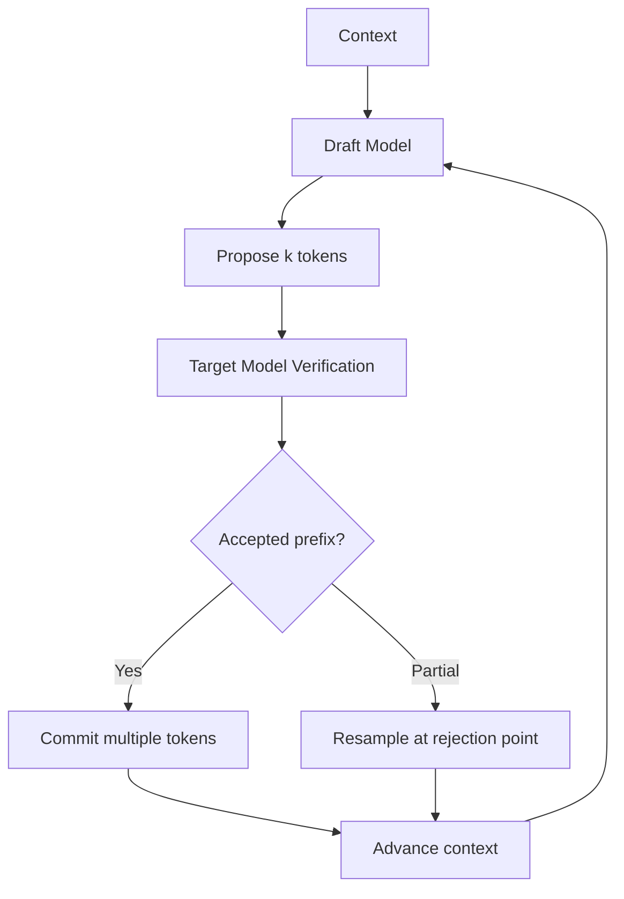

# Speculative Decoding (LLM Inference Acceleration)

> 最後更新：2026-04-26
> 相關論文：[Fast Inference from Transformers via Speculative Decoding](https://arxiv.org/abs/2211.17192)、[Medusa](https://arxiv.org/abs/2401.10774)

## 概覽與設計動機
大型語言模型推理的瓶頸通常不在 FLOPs 不夠，而在 autoregressive decoding 的串行性。標準生成流程每產生一個 token，都必須再跑一次 target model，因此即使 GPU 還有剩餘算力，整體延遲仍被逐 token 的 memory movement 與 kernel launch 綁住。Speculative decoding 的設計動機，就是用一個更便宜的 draft path 預先猜出多個候選 token，再用較大的 target model 一次驗證多個位置，從而減少 target model 的完整前向次數。

這個方法的重要性在於，它不像量化或蒸餾那樣直接改變模型能力邊界，也不像只做 batching 那樣依賴流量型態。Leviathan 等人的工作證明，只要驗證與重採樣步驟設計正確，就能在不改變最終分布的前提下提升解碼吞吐。之後的 Medusa 與 TGI speculation 等實作則進一步把 speculative decoding 從「雙模型草稿-驗證」拓展為「多 decoding heads」或「n-gram speculation」，讓這條路線更接近生產系統可用的 latency optimization primitive。

## 核心機制深度解析

### 關鍵名詞與專案拆解

| 名詞 / 專案 | 它解決什麼問題 | 核心機制 | 與相鄰技術差異 | 何時適合 / 不適合 |
|-------------|----------------|----------|----------------|-------------------|
| Draft Model | target model 每 token 都太貴 | 用較小模型先猜多個 token | 比量化更偏 runtime 協作，不直接改 target 權重 | 適合已有小模型可共用 tokenizer；不適合 draft 太差的任務 |
| Target Model | 需要維持最終分布正確性 | 對 draft 候選做並行驗證與必要重採樣 | 比單純 teacher forcing 多了接受率控制 | 適合高價值主模型；不適合極小模型場景 |
| Verification Step | 草稿可能猜錯 | 一次檢查多個候選 token，找出最長可接受前綴 | 比 greedy decode 多一層 acceptance / rejection 邏輯 | 適合 memory-bound decode；不適合非常短輸出 |
| Medusa | 維護獨立 draft model 太麻煩 | 在同一 backbone 上增加多個 decoding heads | 比經典 speculative decoding 少一個獨立 draft model | 適合能接受額外微調的服務；不適合完全無訓練資源 |
| N-gram Speculation | 沒有 draft 模型可用 | 直接利用上下文中的重複 token pattern 做猜測 | 比 Medusa 更便宜，但接受率更依賴資料重複性 | 適合 code 或重複文本；不適合自由生成文本 |

### 演算法流程
1. 使用 draft model 根據當前上下文一次提議 $k$ 個候選 token。
2. 將整段候選序列交給 target model 做一次前向傳播。
3. 逐位置比較 target model 與 draft model 對候選 token 的機率比，計算是否接受。
4. 若前綴全部通過，就一次提交這段前綴，並再向前推進多個 token。
5. 若在第 $j$ 個位置失敗，保留前 $j-1$ 個已接受 token。
6. 在失敗位置依 target-aware 修正分布重新採樣，避免最終分布被 draft bias 扭曲。
7. 重複以上步驟，直到達到停止條件。

### 關鍵數學
Speculative decoding 的核心接受率可以寫成：

$$
\alpha_i = \min\left(1, \frac{p(d_i \mid x, d_{<i})}{q(d_i \mid x, d_{<i})}\right)
$$

其中：

- $p$ 表示 target model 的條件分布。
- $q$ 表示 draft model 的條件分布。
- $d_i$ 表示 draft 在第 $i$ 個位置提議的 token。
- $x$ 表示已存在的上下文。

若第 $i$ 個 token 被拒絕，則從修正分布重採樣：

$$
r(x) = \frac{\max(0, p(x) - q(x))}{\sum_y \max(0, p(y) - q(y))}
$$

直觀上，這保證了即使 draft model 很粗糙，最終樣本仍然能對齊 target model 的原始分布。這也是 speculative decoding 與「直接讓小模型猜完、大模型只做 fallback」最大的差別。

### 架構圖


## 與前代技術的比較

| 技術 | 優點 | 限制 | 適用場景 |
|------|------|------|----------|
| Standard autoregressive decode | 邏輯最簡單、分布正確性直觀 | 每 token 都要完整跑大模型，延遲高 | baseline、低複雜度服務 |
| Speculative decoding | 在維持輸出分布下提升速度 | 需要 draft model、接受率治理與 tokenizer 相容性 | 高吞吐 LLM API、長輸出生成 |
| Medusa | 不必維護獨立 draft model | 需要額外訓練 heads，與 backbone 綁定較深 | 自家可微調模型服務 |
| N-gram speculation | 幾乎沒有訓練成本 | 依賴上下文重複性，通用文本不一定有效 | code completion、重複模板輸出 |

## 工程實作

### 環境設定
```bash
python -m venv .venv
source .venv/bin/activate
pip install --upgrade pip
```

### 核心實作（完整可執行）
```python
from __future__ import annotations


TARGET = {
    "": {"the": 0.60, "a": 0.25, "an": 0.15},
    "the": {"cat": 0.65, "dog": 0.20, "model": 0.15},
    "the cat": {"sat": 0.70, "slept": 0.20, "ran": 0.10},
}

DRAWFT = {
    "": ["the", "cat", "sat"],
    "the": ["cat", "sat"],
    "the cat": ["sat"],
}


def target_prob(context: str, token: str) -> float:
    return TARGET.get(context, {}).get(token, 0.0)


def draft_tokens(context: str, max_tokens: int) -> list[str]:
    return DRAWFT.get(context, [])[:max_tokens]


def speculative_step(context_tokens: list[str], max_draft_tokens: int = 3) -> tuple[list[str], str]:
    accepted = []
    context = " ".join(context_tokens)

    for token in draft_tokens(context, max_draft_tokens):
        current_context = " ".join(context_tokens + accepted)
        if target_prob(current_context, token) >= 0.5:
            accepted.append(token)
        else:
            break

    if accepted:
        context_tokens.extend(accepted)
        return context_tokens, f"accepted={accepted}"

    fallback = max(TARGET.get(context, {"<eos>": 1.0}), key=TARGET.get(context, {"<eos>": 1.0}).get)
    context_tokens.append(fallback)
    return context_tokens, f"fallback={fallback}"


def main() -> None:
    generated = []
    for _ in range(3):
        generated, note = speculative_step(generated)
        print(note, "->", generated)


if __name__ == "__main__":
    main()
```

### 最小驗證步驟
```bash
python topic_speculative_decoding_demo.py
```

### 預期觀察
- 第一輪應一次接受 `the`。
- 第二輪 draft 若仍命中高機率 token，會一次接受多個 token，而不是每輪只前進一個。
- 若 draft token 不符合 target 門檻，流程應回退到 fallback 採樣，而不是直接信任草稿。

### 工程落地注意事項
- **Latency**：接受率低時，draft path 的額外計算可能吃掉收益，尤其短輸出最明顯。
- **成本**：雙模型 speculative decode 會增加總算力使用，但若 target passes 顯著下降，端到端成本仍可能更低。
- **穩定性**：draft / target tokenizer 不一致、KV cache 管理錯誤、batch scheduling 不協調，都會讓實作複雜度快速上升。
- **Scaling**：在連續 batching 服務中，speculation 要與 paged attention、request packing、prefill / decode scheduling 一起考慮，不能孤立優化。

## 2025-2026 最新進展

### Medusa：把 draft 改成多頭預測
Medusa 用多個 decoding heads 直接在同一 backbone 上預測多個未來 token，避免維護獨立 draft model。工程上它降低了雙模型部署的協調成本，但代價是需要額外訓練與模型特化。

### TGI 的 speculation 支援
Hugging Face TGI 已把 speculation 當成正式概念文件，支援 Medusa 與 n-gram 兩條路線。這代表 speculative decoding 不再只是研究論文中的算法，而是已經進入通用 serving stack 的選項集合。

### N-gram speculation 的場景化價值
在 code completion 或高度重複的文本裡，n-gram speculation 雖然遠不如 draft model 精確，但因為實作極簡，反而可能是低門檻的第一步優化。這是一個典型的工程 trade-off：接受率不一定最高，但導入成本極低。

## 已知限制與 Open Problems
Speculative decoding 並不是免費午餐。第一，當 draft model 與 target model 差距過大時，接受率會迅速下降，讓多做的計算變成純開銷。第二，這個方法主要優化 decode path，對 prefill 很長的場景幫助有限。第三，服務實作常卡在 KV cache、一致性驗證、batch 調度與多租戶公平性，而不是論文裡的接受率公式本身。最後，不同任務的 token entropy 差異很大，對話、程式碼與數學推理的收益不會相同。

## 自我驗證練習
- 練習 1：把範例中的 target 門檻從 `0.5` 改成更高或更低，觀察接受率如何變化。
- 練習 2：把 draft 序列故意改差，驗證 speculative decoding 何時開始失去效益。
- 練習 3：比較 standard decode、draft-target speculation、n-gram speculation 三種模式在不同輸出長度下的行為差異。

## 延伸閱讀
- [來源清單](../docs/references/topic-speculative-decoding-ref.md)

---
*此文件由 AI agent 自動生成並持續更新*

## 更新記錄
- 2026-04-26：建立 speculative decoding 主文，補上接受率數學、Medusa / n-gram speculation、可執行示意程式與 serving trade-off。