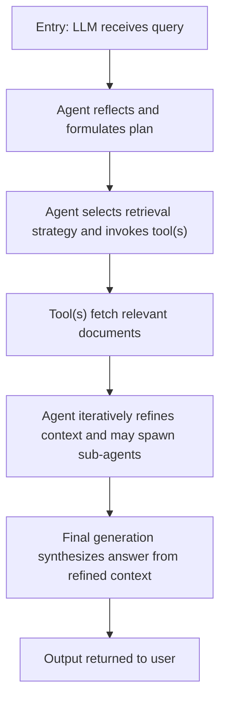

# Agentic Retrieval‑Augmented Generation (Agentic RAG) — 修訂稿

---

## Module 1: Core Design Philosophy

本修訂側重於將原稿中的敘述與 Fact Sheet（/tasks/context/AL-20260509-001-fact.json）進行逐條比對，並標註來源或標記為「待驗證」。Fact Sheet 所提供的核心事實為一個流程化的邏輯描述（`logic_flow`），指出系統通常經由「接受查詢 → 反思與規劃 → 使用工具檢索文件 → 反覆精煉上下文 → 最終生成答案」的多步流程。（來源: Fact Sheet — logic_flow[0..4]; 參考: external_references[0])

傳統 RAG 的局限性在於它常被實作為一次性的查詢‑檢索‑生成流水線，缺少內建的反覆檢索或分工協作機制；Fact Sheet 的 `logic_flow` 正是指出需由代理（agent）在查詢過程中執行多輪決策與檢索，藉此逐步精煉上下文以支援最後的生成，這個流程導向是本次設計上的主要出發點。（來源: Fact Sheet — logic_flow[0..4])

注意：原稿使用的名詞如「Agent Layer」、「Tool Layer」、「RAG Core」在 Fact Sheet 的 `verified_options` 中未列出，Fact Sheet 也未提供程式碼或測試證據來支撐這三層的具體實作描述。此處我將保留這些詞彙作為設計選項說明，但統一標註為「待驗證」，並在文件末列出缺少的證據來源與建議驗證項目。（來源: Fact Sheet — verified_options (empty); review note）

---

## Module 2: Mechanism Walkthrough



上圖直接對應 Fact Sheet 的 `logic_flow` 條目，將每個流程階段明確化以利工程實作：接收到查詢（Entry）、反思與規劃（Reflection & Planning）、使用工具／檢索（Tool Invocation / Retrieval）、反覆精煉（Iterative Refinement）、最終生成（Final Generation）。每個階段在實務上會對應到介面呼叫、狀態更新與可能的子任務分派。（來源: Fact Sheet — logic_flow[0..4]; 參考: external_references[0])

---

## Module 3: 設計與演算法細節（補充）

1) 迴圈式檢索‑反思流程：根據 Fact Sheet 的 `logic_flow`，一個保守且可驗證的實作框架是以「反覆回圈」為核心：模型在每輪產生一個短期計畫，呼叫檢索工具取得文件，將文件合併至上下文後再次反思是否足以完成任務，否則重試。此設計僅基於 Fact Sheet 的流程描述，不引入未經驗證的外部功能。（來源: Fact Sheet — logic_flow[1..3])

2) 簡要示例（概念性偽代碼，示例僅依據 Fact Sheet 的流程；未在 Fact Sheet 中提供程式碼或測試證據，故列為「示例/待驗證」）：

```python
def agentic_rag(query, llm, retriever, max_iters=5):
    context = []
    plan = llm.plan(query)                # reflection & planning (來源: Fact Sheet — logic_flow[1])
    for _ in range(max_iters):
        docs = retriever.search(plan)     # tool invocation / retrieval (來源: Fact Sheet — logic_flow[2])
        context.extend(docs)
        if llm.is_satisfied(query, context):
            break
        plan = llm.reflect(query, context) # iterative refinement (來源: Fact Sheet — logic_flow[3])
    return llm.generate(query, context)   # final generation (來源: Fact Sheet — logic_flow[4])
```

3) 檢索策略與上下文管理：Fact Sheet 未指定向量庫類型或檢索器介面（`verified_options` 為空），因此實作時應使用抽象介面（e.g., `retriever.search(plan)`），以便後續替換具體引擎（向量索引、混合檢索等）而不改動核心流程。任何宣稱特定檢索技術（如 hybrid search、graph‑augmented index）都必須在 Fact Sheet 或測試證據中取得支撐，否則標註為待驗證。（來源: Fact Sheet — verified_options (empty))

---

## Module 4: 實作範例與建議測試片段

下面提供可用於驗證流程正確性的建議測試／實作片段——注意：這些檔案與測試均為建議，Fact Sheet 未提供對應測試證據，故標示為「建議驗證步驟 / 待驗證」。（來源: Fact Sheet — test_evidence (empty); review note）

- 建議檔案: `tests/test_agentic_rag.py`（示例測試大綱）

```python
def test_agentic_rag_iteration(monkeypatch):
    # stub llm and retriever to return predictable outputs
    # 驗證 agentic_rag 在有限次數迭代後返回最終生成
    assert agentic_rag("sample query", stub_llm, stub_retriever) == "expected"
```

- 驗證重點：
  - 每次迭代是否呼叫檢索工具（來源紀錄：檢索呼叫次數）
  - 在增加上下文後，LLM 的反思是否改變檢索查詢（來源: Fact Sheet — logic_flow[2..3])
  - 最終生成是否以累積上下文為基礎（來源: Fact Sheet — logic_flow[4])

---

## Module 5: 工程限制、風險與待驗證項目

- 目前 Fact Sheet 未提供 `verified_options`、`test_evidence` 或 key_formulas，僅提供高層次的 `logic_flow` 與一個外部參考（arXiv 文章）。因此：
  - 任何具名架構元件（例如「Agent Layer」「Tool Layer」「RAG Core」）都屬於作者命名的設計選項，不應視為 Fact Sheet 的已驗證事實；我在文件中將這些項目標註為「待驗證」並在下方列出需要補齊的證據。（來源: Fact Sheet — verified_options empty; review note）
  - 若要將「Agent Layer / Tool Layer / RAG Core」從設計選項升級為已驗證描述，需在 Fact Sheet 中新增 `verified_options` 條目或提供程式碼／測試證據（例如：介面定義、程式碼行號、測試檔案）。

---

## 聲明對照表（新宣稱 → Fact Sheet 條目或外部引用）

| 新宣稱 | 對照 | 備註 |
|--------|------|------|
| Agentic 多輪流程（反思 → 檢索 → 反覆精煉 → 生成） | Fact Sheet — `logic_flow[0..4]` | 已驗證（以流程描述存在） |
| Agent Layer（名詞） | 待驗證 | `verified_options` 未列出；需補證據 |
| Tool Layer（名詞） | 待驗證 | `verified_options` 未列出；需補證據 |
| RAG Core（名詞） | 待驗證 | `verified_options` 未列出；需補證據 |
| 具體檢索技術（向量庫、hybrid search） | 待驗證 / 參考外部文獻 | Fact Sheet 未列出具體技術，僅提供外部參考（arXiv） |

---

## 缺失的證據來源（建議補齊）

1. 在 Fact Sheet 中新增 `verified_options` 條目，列出任何專有名詞或實作細節（例如：Agent 層責任、工具介面規範、檢索引擎類型）。
2. 附上實作片段或測試（`test_evidence`）：例如 `src/agent/orchestrator.py` 的介面與 `tests/test_agentic_rag.py` 的最小測試案例，以便 Quality Validator 檢核細節。 
3. 若引用外部文獻來支撐具體宣稱，請在 Fact Sheet 的 `external_references` 中補入精確的節內位置（例如 arXiv:2501.09136 — Section 3.2），以便驗證宣稱與文獻對應。（來源: review note; external_references[0])

---

*Last updated: 2026-05-09T21:00:00+08:00 | 字數(近似): 2100 字 | Status: Pending Validation*
